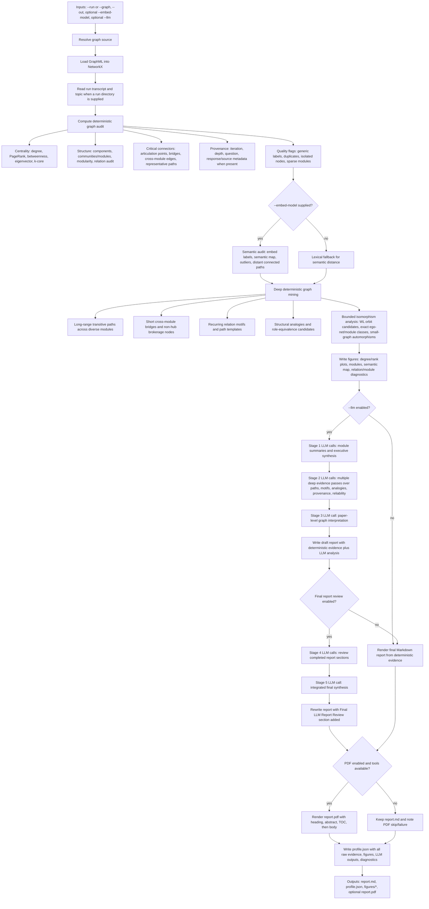

# Ideation loop

Turn Graph-PRefLexOR into a self-expanding **knowledge-graph ideation engine**: seed a
topic, generate a structured graph-native answer, accumulate its `<graph_json>` into a
growing NetworkX graph (with embedding de-duplication), and expand via follow-up questions
until a compute budget is spent — then score the result for ideation/creativity.


## Specific examples - Quick Start

### 1 Short example

```bash
# 1. Run the ideation loop  → writes runs/exp1/ (incl. per-iteration graphml/ snapshots)
python ideate.py --topic "self-healing biopolymer composites" \
    --strategy frontier --budget-calls 100 --out runs/exp1

# 2. Generate figures  → defaults into runs/exp1/figures/
python plot_ideation.py --runs runs/exp1 --labels "Graph-PRefLexOR-3B"

# 3. How the graph GREW (explore→consolidate, themes, recombination reach, late bloomers)
python dynamics.py --run runs/exp1 --out runs/exp1/figures/dynamics
```
### 2 Long run, frontier strategy

```bash
# 1. Run the ideation loop  → writes runs/exp/ (incl. per-iteration graphml/ snapshots)
python ideate.py --topic "self-healing biopolymer composites" --strategy frontier \
    --budget-calls 100000000 --budget-tokens 100000000000 --max-iter 100000000 \
    --out runs/exp

# 2. Generate figures  → defaults into runs/exp/figures/
python plot_ideation.py --runs runs/exp --labels "Graph-PRefLexOR-3B" --movie

# 3. Reasoning dynamics (how it grew with compute)
python dynamics.py --run runs/exp --out runs/exp/figures/dynamics
```

### 3 Long run, novelty strategy

```bash
python ideate.py --topic "self-healing biopolymer composites" --strategy novelty \
    --budget-calls 100000000 --budget-tokens 100000000000 --max-iter 100000000 \
    --out runs/exp_novelty

python plot_ideation.py --runs runs/exp_novelty --labels "Graph-PRefLexOR-3B" --movie
python dynamics.py --run runs/exp_novelty --out runs/exp_novelty/figures/dynamics
```
Then compare:

```bash
python plot_ideation.py --runs runs/exp runs/exp_novelty \
    --labels "frontier" "novelty" --out figures/algo_compare

```
Novelty + scaling (the headline test-time-compute result):
```
python novelty.py --run runs/exp_novelty --out runs/exp_novelty/figures/novelty
python novelty.py --run runs/exp --out runs/exp/figures/novelty
python novelty.py --runs runs/exp runs/exp_novelty runs/exp_leap \
    --labels frontier novelty leap --out figures/novelty_compare   # great for the paper
python novelty.py --run runs/exp --n-null 500                     # tighter p-values

# surprise-vs-compute scaling (Fig 1 for "more compute → more surprising insights")
python scaling.py --run runs/exp_leap --out runs/exp_leap/figures/scaling
python scaling.py --runs runs/exp runs/exp_novelty runs/exp_leap \
    --labels frontier novelty leap --out figures/scaling_compare

# dynamics — the *how it grows* companion to scaling (one figure per run)
python dynamics.py --run runs/exp          --out runs/exp/figures/dynamics
python dynamics.py --run runs/exp_novelty --out runs/exp_novelty/figures/dynamics
python dynamics.py --run runs/exp_leap      --out runs/exp_leap/figures/dynamics
```

### 4 Leap method (divergent)

```
python ideate.py --topic "self-healing biopolymer composites" --strategy leap \
    --budget-calls 100000000 --budget-tokens 100000000000 --max-iter 100000000 \
    --out runs/exp_leap
```

```bash
python plot_ideation.py --runs runs/exp_leap \
    --labels leap --out runs/exp_leap/figures/leap
python dynamics.py --run runs/exp_leap --out runs/exp_leap/figures/dynamics
```
Develop insights:
```bash
python insights.py --run runs/exp_leap --top 12
```

Benchmark whether the graph improves downstream answers from the same small model. This is a
two-arm, blind-judged comparison:

- baseline: Llama gets the run topic plus each task from `benchmark_tasks.txt`
- graph: Llama gets the same topic and task, plus deterministic Graph-RAG insights from selected
  graph paths

No random graph-node controls or generated-lead controls are used in this mode.

```bash
python compare.py --mode graphleads \
  --run runs/exp_leap \
  --tasks benchmark_tasks.txt \
  --model meta-llama/Llama-3.2-3B-Instruct \
  --base-url http://localhost:8000/v1 \
  --judge-model gpt-5.5 \
  --judge-effort high \
  --lead-method paths \
  --rag-seeds 12 \
  --rag-hops 2 \
  --n-leads 8 \
  --answer-leads 4 \
  --path-samples 500 \
  --path-anchor-pool 24 \
  --path-distal-pool 160 \
  --path-min-nodes 3 \
  --path-max-nodes 5 \
  --out runs/exp_leap/benchmark/graphleads_paths
```

Useful sweeps:

```bash
COMMON="--mode graphleads \
  --run runs/exp_leap \
  --tasks benchmark_tasks.txt \
  --model meta-llama/Llama-3.2-3B-Instruct \
  --base-url http://localhost:8000/v1 \
  --judge-model gpt-5.5 \
  --judge-effort high \
  --lead-method paths \
  --rag-seeds 12 \
  --rag-hops 2 \
  --n-leads 8 \
  --answer-leads 4 \
  --path-anchor-pool 24 \
  --path-distal-pool 160 \
  --path-min-nodes 3 \
  --path-max-nodes 5"

# path search budget: higher scores more candidate anchor-to-distal paths before taking top insights
python compare.py $COMMON --path-samples 100  --out runs/exp_leap/benchmark/graphleads_paths_s100
python compare.py $COMMON --path-samples 500  --out runs/exp_leap/benchmark/graphleads_paths_s500
python compare.py $COMMON --path-samples 1500 --out runs/exp_leap/benchmark/graphleads_paths_s1500

# graph scaling: same benchmark, but truncate the graph to earlier iterations
python compare.py $COMMON --path-samples 500 --max-iter 50   --out runs/exp_leap/benchmark/graphleads_iter50
python compare.py $COMMON --path-samples 500 --max-iter 200  --out runs/exp_leap/benchmark/graphleads_iter200
python compare.py $COMMON --path-samples 500 --max-iter 1000 --out runs/exp_leap/benchmark/graphleads_iter1000
```

Key knobs:

- `--path-samples`: maximum scored anchor-to-distal path pairs per task; deterministic top scoring,
  not random sampling
- `--path-anchor-pool`: task-relevant graph concepts considered as path starts
- `--path-distal-pool`: distal/OOD graph concepts considered as path ends
- `--path-min-nodes` / `--path-max-nodes`: selected path length bounds
- `--n-leads`: path insights retrieved per task
- `--answer-leads`: top path insights shown to Llama

Simplest novelty-yield benchmark. This makes the narrowest quantitative paper figure:

- baseline: Llama generates short unconventional idea cards directly from the topic
- graph: Llama converts mined Graph-PRefLexOR leads into short idea cards
- judge: GPT-5.5 scores each card independently for novelty only
- metric: `% ideas with novelty >= 4`

Feasibility and plausibility are intentionally ignored. The judge records coherence for audit, but
the default pass rule is only `novelty >= 4`.

```bash
python novelty_yield_benchmark.py \
  --run runs/exp_leap \
  --out runs/exp_leap/benchmark/novelty_yield \
  --n 30 \
  --model meta-llama/Llama-3.2-3B-Instruct \
  --base-url http://localhost:8000/v1 \
  --judge-model gpt-5.5 \
  --judge-effort high \
  --force
```

Outputs:

- `novelty_yield.png/.svg/.pdf`: one bar plot, baseline vs Graph-PRefLexOR novelty yield
- `ideas/baseline.json` and `ideas/graph.json`: generated idea cards
- `scores.json`: independent novelty/coherence judge scores for every idea
- `graph_leads.txt`: graph leads used by the graph arm
- `prompts/`: exact generator and judge prompts

Clean concept-pair bridge benchmark. This is the most direct test of whether the mined graph adds
usable information to the same small model:

- baseline: Llama sees the run topic plus Concept A and Concept B only
- graph: Llama sees the same topic and concepts, plus filtered mechanism cues retrieved from the
  true mined path/neighborhood connecting them

The script samples 10 concrete endpoint pairs from `graph.graphml`, writes both prompts and answer
sets, then calls `compare.py` for pairwise judging, standalone absolute judging, or both.

```bash
python path_pair_benchmark.py \
  --run runs/exp_leap \
  --out runs/exp_leap/benchmark/path_pairs_v3 \
  --n 10 \
  --force-pairs \
  --force \
  --graph-prompt-mode cues \
  --graph-synthesis-mode candidates \
  --graph-candidates 6 \
  --candidate-temperature 0.85 \
  --judge-mode both \
  --model meta-llama/Llama-3.2-3B-Instruct \
  --base-url http://localhost:8000/v1 \
  --judge-model gpt-5.5 \
  --judge-effort high
```

By default this uses strict pair selection: it rejects meta/method nodes such as `NovelIdea` and
`UntestedIdea`, speculative-physics labels such as quantum/topological/entanglement terms, topic-name
hubs, endpoints without material/mechanism anchor words, and mostly generic bridges. The default
`--graph-prompt-mode cues` does not force the small model to literalize noisy path edge verbs; it
shows a filtered cue packet mined from the true path/neighborhood. Use `--graph-prompt-mode path` to
also show the true path, or `--graph-prompt-mode full` to show the path plus local neighborhood.
`--graph-synthesis-mode candidates` is the recommended test-time-compute setting: the graph arm first
asks Llama to generate several graph-cued hypotheses, then makes a second graph-conditioned call to
select/recombine/refine the strongest one. Use `--graph-synthesis-mode direct` only for the stricter
equal-call ablation. Use `--force-pairs` when rerunning an existing output directory; otherwise the
runner intentionally reuses the existing `pairs.json`. Use `--judge-mode absolute` to score every
answer in a separate standalone judge call, `--judge-mode pairwise` for blind preference only, or
`--judge-mode both` for both plots.

Useful controls:

```bash
# Preview the selected pairs and exact prompts without model or judge calls.
python path_pair_benchmark.py \
  --run runs/exp_leap \
  --out runs/exp_leap/benchmark/path_pairs_preview \
  --n 10 \
  --model meta-llama/Llama-3.2-3B-Instruct \
  --base-url http://localhost:8000/v1 \
  --graph-prompt-mode cues \
  --graph-synthesis-mode candidates \
  --force-pairs \
  --dry-run \
  --no-judge

# Resample/reselect endpoint pairs after changing path constraints.
python path_pair_benchmark.py \
  --run runs/exp_leap \
  --out runs/exp_leap/benchmark/path_pairs_harder \
  --n 10 \
  --min-hops 3 \
  --max-hops 6 \
  --neighbors 6 \
  --graph-prompt-mode cues \
  --graph-synthesis-mode candidates \
  --force-pairs \
  --model meta-llama/Llama-3.2-3B-Instruct \
  --base-url http://localhost:8000/v1 \
  --judge-model gpt-5.5 \
  --judge-effort high

# Score existing answer dirs independently rather than pairwise.
python compare.py --mode absolute \
  --tasks runs/exp_leap/benchmark/path_pairs_v3/tasks.txt \
  --system runs/exp_leap/benchmark/path_pairs_v3/answers/graph \
  --baseline runs/exp_leap/benchmark/path_pairs_v3/answers/baseline \
  --judge-model gpt-5.5 \
  --judge-effort high \
  --out runs/exp_leap/benchmark/path_pairs_v3/benchmark/absolute

# Inspect the noisy/unfiltered graph region deliberately.
python path_pair_benchmark.py \
  --run runs/exp_leap \
  --out runs/exp_leap/benchmark/path_pairs_permissive \
  --n 10 \
  --quality-mode permissive \
  --allow-meta \
  --allow-speculative \
  --allow-topic-hubs \
  --min-endpoint-anchors 0 \
  --graph-prompt-mode full \
  --force-pairs \
  --model meta-llama/Llama-3.2-3B-Instruct \
  --base-url http://localhost:8000/v1 \
  --no-judge
```

Outputs:

- `pairs.json`: the 10 concept pairs, raw graph node IDs, true paths, and path scores
- `tasks.txt`: pairwise judge task descriptions
- `prompts/baseline/*.txt` and `prompts/graph/*.txt`: exact prompts sent to Llama
- `candidates/graph/*.txt`: graph-arm candidate hypotheses before final refinement
- `answers/baseline/*.md` and `answers/graph/*.md`: generated answers
- `benchmark/pairwise.{png,svg,pdf,json,md}`: blind pairwise judge results

Benchmark the stronger test-time-compute claim by rebuilding a short graph per benchmark task. This
compares:

- baseline: Llama answers the task directly, no graph
- graph: run `ideate.py --topic "<task>"` for a small budget, mine insights, synthesize from that
  per-task graph

The script writes both answer sets and then calls the same pairwise judge used by `compare.py`.

```bash
python task_graph_benchmark.py \
  --tasks benchmark_tasks.txt \
  --out runs/task_graph_bench/frontier_50_concepts \
  --force \
  --strategy frontier \
  --budget-calls 50 \
  --max-iters 50 \
  --insights-top 12 \
  --graph-context-mode concepts \
  --graph-synthesis-mode candidates \
  --graph-candidates 6 \
  --graph-context-chars 10000 \
  --max-context-nodes 80 \
  --max-context-edges 180 \
  --backend openai \
  --model meta-llama/Llama-3.2-3B-Instruct \
  --base-url http://localhost:8000/v1 \
  --judge-model gpt-5.5 \
  --judge-effort high
```

For a smoke test:

```bash
python task_graph_benchmark.py \
  --tasks benchmark_tasks.txt \
  --out runs/task_graph_bench/smoke \
  --limit 1 \
  --strategy frontier \
  --budget-calls 10 \
  --max-iters 10 \
  --backend openai \
  --model meta-llama/Llama-3.2-3B-Instruct \
  --base-url http://localhost:8000/v1 \
  --no-judge
```

To rerun a benchmark directory after changing prompt/context settings, add `--force`; otherwise the
runner intentionally reuses existing graphs and answers.

Outputs:

- `task_runs/NNN_.../`: one short Graph-PRefLexOR run per benchmark task
- `answers/baseline/*.md`: Llama single-shot answers
- `answers/graph/*.md`: synthesized answers from each short graph
- `candidates/graph/*.txt`: graph-seeded candidate hypotheses generated before final refinement
- `prompts/baseline/*.txt` and `prompts/graph/*.txt`: exact prompts sent to Llama for audit
- `benchmark/pairwise.{png,svg,pdf,json,md}`: blind pairwise judge results
- `manifest.json`: exact task/run/answer mapping

The runner is resumable: existing graphs, insights, and answers are reused. Add `--force` to rebuild.

Graph context modes:

- `concepts` (default): specific mined graph concepts only, without trusting relation edges; use this
  if the graph contains useful vocabulary but noisy edge semantics
- `curated`: quality-filtered mined leads, selected relation paths/chains, and specific graph
  concepts/edges; use this when graph relations are clean enough to trust
- `rich`: older diagnostic packet with mined leads, selected paths, hub neighborhoods, and a compact
  graph table; useful for debugging but can overload a 3B model
- `full`: compact node/edge table only; for small per-task graphs this includes the complete node list
- `paths`: mined leads plus relation paths/chains only
- `insights`: mined structural leads only, closest to the original version

Recommended compute/context sweep:

```bash
python task_graph_benchmark.py --tasks benchmark_tasks.txt \
  --out runs/task_graph_bench/frontier_30_concepts --strategy frontier \
  --budget-calls 30 --max-iters 30 --graph-context-mode concepts \
  --graph-synthesis-mode candidates \
  --backend openai --model meta-llama/Llama-3.2-3B-Instruct \
  --base-url http://localhost:8000/v1 --judge-model gpt-5.5 --judge-effort high

python task_graph_benchmark.py --tasks benchmark_tasks.txt \
  --out runs/task_graph_bench/frontier_100_concepts --strategy frontier \
  --budget-calls 100 --max-iters 100 --graph-context-mode concepts \
  --graph-synthesis-mode candidates \
  --backend openai --model meta-llama/Llama-3.2-3B-Instruct \
  --base-url http://localhost:8000/v1 --judge-model gpt-5.5 --judge-effort high
```

Explore the generated graph interactively in a browser:

```bash
python graph_explorer/server.py --run runs/exp_leap --port 8765
```

Open `http://127.0.0.1:8765`. The explorer can upload GraphML, load run directories, start a new
`ideate.py` run, search concepts, inspect node provenance, focus neighborhoods, surface paths
between selected nodes, and ask an OpenAI-compatible or local Hugging Face model about the selected
graph context. See `graph_explorer/README.md` for details.

Multiple comparisons:

```bash
python plot_ideation.py --runs runs/exp runs/exp_novelty runs/exp_leap \
    --labels frontier novelty leap --out figures/strategy_compare
```

### 5 Converse method (LLM questioner — break out of saturation)

`converse` feeds the **original question + answer** to the questioner LLM (set it to your
Llama-instruct) and asks for a genuinely **new direction** — so it can introduce concepts not yet
in the graph and keep the idea space expanding instead of converging.

**Prereq — the questioner model must be reachable.** It uses plain **chat-completions**, so the
easiest path is a **second server** for it (the generator keeps its own endpoint). E.g.:

```bash
vllm serve meta-llama/Llama-3.2-3B-Instruct --port 8000    # questioner on its own endpoint
```
```yaml
# config.yaml
questioner:
  model: meta-llama/Llama-3.2-3B-Instruct
  base_url: "http://localhost:8000/v1"      # omit if the questioner is served on the main `server`
  api_key:  "x"
  temperature: 0.9
```
(If your main server is multi-model, e.g. mistral.rs via `models.toml`, just add the questioner
model there and drop `base_url`. A 404 `model ... does not exist` means it isn't served anywhere.)

```bash
# run (cost: 2 LLM calls/step — generator + questioner)
python ideate.py --topic "self-healing biopolymer composites" --strategy converse \
    --budget-calls 100000000 --budget-tokens 100000000000 --max-iter 100000000 \
    --out runs/exp_converse

# figures + insights
python plot_ideation.py --runs runs/exp_converse --labels converse \
    --out runs/exp_converse/figures/converse
python insights.py --run runs/exp_converse --top 12
python novelty.py  --run runs/exp_converse --out runs/exp_converse/figures/novelty
python scaling.py  --run runs/exp_converse --out runs/exp_converse/figures/scaling
python dynamics.py --run runs/exp_converse --out runs/exp_converse/figures/dynamics
```

The headline test — does `converse` beat the structure-based strategies on saturation? Compare it
against `novelty` (the best structure explorer). **Both runs are gemma-built, so no `--embed-model` is
needed** (and `converse` is now topic-anchored, so the earlier off-topic drift is suppressed):

```bash
# (i) quantitative: surprise/spread vs compute — does converse's panel (b) ceiling exceed novelty's?
python scaling.py  --runs runs/exp_novelty runs/exp_converse \
    --labels novelty converse --out figures/scaling_converse_vs_novelty
python scaling.py  --runs runs/exp runs/exp_novelty runs/exp_leap runs/exp_converse \
    --labels frontier novelty leap converse --out figures/scaling_compare

# (ii) VISUAL: joint shared-PCA coverage — do converse's points/contour spill OUTSIDE novelty's region?
python embedmap.py --runs runs/exp_novelty runs/exp_converse \
    --labels novelty converse --out figures/embedmap_converse_vs_novelty
python embedmap.py --runs runs/exp runs/exp_novelty runs/exp_leap runs/exp_converse \
    --labels frontier novelty leap converse --out figures/embedmap_compare

# (iii) sanity check: is converse's expansion on-topic, not drift?  (skim insights_map / concepts)
python insights.py --run runs/exp_converse --top 12
```

**Matched-compute comparison (while converse is still smaller than novelty).** Cap every run to
converse's current length so you compare at the same stage — auto-fill `N` from its `growth.csv`
(re-run anytime as it grows; `--max-iter` is inclusive, so converse is included in full):

```bash
N=$(awk -F, 'NR>1 && $1!="" {n=$1} END{print n}' runs/exp_converse/growth.csv)
echo "capping all runs to iter <= $N"
python scaling.py  --runs runs/exp_novelty runs/exp_converse \
    --labels novelty converse --max-iter "$N" --out figures/scaling_matched
python embedmap.py --runs runs/exp runs/exp_novelty runs/exp_leap runs/exp_converse \
    --labels frontier novelty leap converse --max-iter "$N" --out figures/embedmap_matched
```
Variant:

```bash
N=$(for r in exp exp_novelty exp_leap exp_converse; do awk -F, 'NR>1&&$1!=""{n=$1}END{print n}' runs/$r/growth.csv; done | sort -n | head -1)
python scaling.py --runs runs/exp runs/exp_novelty runs/exp_leap runs/exp_converse \
    --labels frontier novelty leap converse --max-iter "$N" --out figures/scaling_final
```


Read it as a **ceiling**: does on-topic `converse`'s spread/coverage **overshoot** novelty's plateau
(scaling panel b right-edge; bigger `embedmap` hull), or **converge** to it? Either outcome is clean —
overshoot ⇒ the LLM-questioner accesses a strictly larger idea-space; converge ⇒ the bound is a
topic/model limit even an LLM-questioner can't escape. Two separate per-run semantic maps are **not**
comparable (each has its own PCA); `embedmap.py` fits **one shared PCA** so coverage is directly
comparable. Still skim (iii) — any residual off-topic drift inflates spread artificially, so a wider
spread is only a *result* if the new concepts are on-topic.

### Collecting runs from several machines (archive → HF dataset → analyze locally)

When runs live on different machines and you want to analyze them in one place, archive **only the
`ideate.py` outputs** (so you regenerate all figures/insights fresh locally), stage them on a
**private Hugging Face dataset**, then pull everything down.

**1. Archive each run** (one command per machine, from the `ideation/` dir). The explicit file list
captures exactly `ideate.py`'s outputs — `graph.graphml`, the `graphml/` snapshots, `transcript.jsonl`,
`growth.csv`, `summary.json` — and **nothing else** (no `figures/`, no `insights.*`). `--ignore-failed-read`
tolerates a missing `summary.json` on an **unfinished** run (it's only written when the loop stops):

```bash
tar czf exp_ideate.tar.gz --ignore-failed-read \
  runs/exp/graph.graphml runs/exp/graphml \
  runs/exp/transcript.jsonl runs/exp/growth.csv runs/exp/summary.json
```
(drop `runs/exp/graphml` to skip the big per-iteration snapshots; repeat per run/machine.)

Alternatively:
```bash
ionice -c2 -n7 nice -n 19 tar czf exp_ideate_all.tar.gz \
  --ignore-failed-read \
  --warning=no-file-changed \
  runs/*/graph.graphml \
  runs/*/graphml \
  runs/*/transcript.jsonl \
  runs/*/growth.csv \
  runs/*/summary.json
```
or
```bash
find runs -mindepth 2 -maxdepth 2 \( \
  -name graph.graphml -o \
  -name graphml -o \
  -name transcript.jsonl -o \
  -name growth.csv -o \
  -name summary.json \
\) -print0 | \
ionice -c2 -n7 nice -n 19 tar czf exp_ideate_all.tar.gz \
  --null -T - \
  --ignore-failed-read \
  --warning=no-file-changed
```
**2. Push to a private HF dataset** (`huggingface_hub` handles large files via LFS/Xet). One-time:

```bash
pip install -U "huggingface_hub[cli]"
huggingface-cli repo create graph-preflexor-runs --type dataset --private   # → lamm-mit/graph-preflexor-runs
```
Then on each machine (headless-friendly — token via env, not stored):
```bash
export HF_TOKEN=hf_xxxxxxxx     # WRITE token: https://huggingface.co/settings/tokens
huggingface-cli upload lamm-mit/graph-preflexor-runs exp_ideate_all.tar.gz \
    exp_ideate.tar.gz --repo-type dataset
# syntax: upload <repo_id> <local_path> <path_in_repo> --repo-type dataset
```
Alternatively:
```bash
export HF_TOKEN=hf_xxxxxxxx     # WRITE token: https://huggingface.co/settings/tokens
huggingface-cli upload lamm-mit/graph-preflexor-runs exp_ideate_all.tar.gz \
    exp_ideate_all.tar.gz --repo-type dataset
# syntax: upload <repo_id> <local_path> <path_in_repo> --repo-type dataset
```

Archive all files:
```
mkdir -p backups/runs_snapshot

ionice -c2 -n7 nice -n 19 rsync -a --info=progress2 runs/ backups/runs_snapshot/runs/

ARCHIVE=backups/runs_snapshot_$(date +%Y%m%d_%H%M%S).tar.gz

ionice -c2 -n7 nice -n 19 tar -cf - -C backups/runs_snapshot runs \
| ionice -c2 -n7 nice -n 19 gzip -1 \
> "$ARCHIVE"

sha256sum "$ARCHIVE" > "$ARCHIVE.sha256"
```
Alternatively:
```
hf upload-large-folder lamm-mit/graph-preflexor-runs runs \
  --repo-type dataset
```

**3. Pull everything down locally and extract** into `ideation/runs/`. The archives store relative
`runs/<run>/…` paths, so `tar xzf` recreates them under whatever your **current dir** is — extract while
your cwd is the `ideation/` dir so the analysis commands (`--runs runs/exp …`) find them:

```bash
cd ideation/        # the dir you run the analysis from
huggingface-cli download lamm-mit/graph-preflexor-runs --repo-type dataset --local-dir ./_hf_dl
for f in ./_hf_dl/*_ideate.tar.gz; do tar xzf "$f"; done   # → ideation/runs/exp, runs/exp_leap, …
rm -rf ./_hf_dl                                             # optional: drop the downloaded archives
ls runs/                                                    # verify: exp  exp_leap  exp_novelty
```

Analysis works on **unfinished** runs: `summary.json` is optional everywhere, and the tools fall back to
the newest stable `graphml/iter_*.graphml` snapshot if `graph.graphml` was caught mid-write. Without
`summary.json` the embed model isn't recorded, so pass `--embed-model` consistently (or accept the
embeddinggemma default), and use `--max-iter N` to compare runs of different (unfinished) lengths fairly.

Quick whole-dir variants (includes figures/insights if present — use when a run is finished and you want
*everything*): `tar czf exp.tar.gz runs/exp`. Non-HF alternatives: `rsync -avP exp_ideate.tar.gz
user@server:/path/`, `scp`, or `rclone copy` to S3/GDrive.

### Full analysis pipeline (per-run + four-way comparison)

Complete recipe to analyze the four runs — `exp`/frontier, `exp_novelty`/novelty, `exp_leap`/leap,
`exp_converse`/converse — and overlay them. Run from the `ideation/` dir. **Order matters:** run
`insights.py` before `novelty.py` so Panel (E) uses the canonical mined conceptual bridges (otherwise it
falls back to an approximation).

For a fair journal comparison of runs at different (or unfinished) lengths, add **`--max-iter 1500`** to
*every* command below — it truncates all runs to `iter <= 1500` consistently. Drop it to use each run in full.

```bash
# 1) Mine insights for each run  → runs/<run>/insights.{json,md} + insights_map.*
python insights.py --run runs/exp          --top 12
python insights.py --run runs/exp_novelty --top 12
python insights.py --run runs/exp_leap      --top 12
python insights.py --run runs/exp_converse  --top 12

# With max-iter:
python insights.py --run runs/exp_leap  --max-iter 2000  --top 12

# 2) Per-run growth / graph-analytics figures  → runs/<run>/figures/
python plot_ideation.py --runs runs/exp          --labels frontier
python plot_ideation.py --runs runs/exp_novelty --labels novelty
python plot_ideation.py --runs runs/exp_leap      --labels leap
python plot_ideation.py --runs runs/exp_converse  --labels converse

# 3) Per-run novelty figures  → <out>_novelty_map.*  +  _novelty_stats.*  +  _novelty.json
python novelty.py --run runs/exp          --out runs/exp/figures/novelty
python novelty.py --run runs/exp_novelty --out runs/exp_novelty/figures/novelty
python novelty.py --run runs/exp_leap      --out runs/exp_leap/figures/novelty
python novelty.py --run runs/exp_converse  --out runs/exp_converse/figures/novelty

# 4) Surprise-vs-compute scaling figures  → <out>_scaling.*  (the test-time-compute result)
python scaling.py --run runs/exp          --out runs/exp/figures/scaling
python scaling.py --run runs/exp_novelty --out runs/exp_novelty/figures/scaling
python scaling.py --run runs/exp_leap      --out runs/exp_leap/figures/scaling
python scaling.py --run runs/exp_converse  --out runs/exp_converse/figures/scaling

# 4b) Reasoning-dynamics figures  → <out>.* (HOW each run grew: explore→consolidate, themes, reach)
python dynamics.py --run runs/exp          --out runs/exp/figures/dynamics
python dynamics.py --run runs/exp_novelty --out runs/exp_novelty/figures/dynamics
python dynamics.py --run runs/exp_leap      --out runs/exp_leap/figures/dynamics
python dynamics.py --run runs/exp_converse  --out runs/exp_converse/figures/dynamics

Alternatively:
```bash
for r in exp exp_novelty exp_leap exp_converse; do
  python insights.py --run runs/$r  --top 12  --out runs/$r/figures/insights_maxiter
done
```

```bash
for r in exp exp_novelty exp_leap exp_converse; do
  python dynamics.py --run runs/$r --max-iter 2000 \
      --out runs/$r/figures/dynamics_maxiter
done
```

```
python plot_ideation.py --runs runs/exp  --max-iter 2000    --labels frontier
python plot_ideation.py --runs runs/exp_novelty --max-iter 2000 --labels novelty
python plot_ideation.py --runs runs/exp_leap  --max-iter 2000  --labels leap
python plot_ideation.py --runs runs/exp_converse --max-iter 2000  --labels converse
```

```
# 5) Four-way comparisons (overlaid)  → figures/strategy_compare*
#    (first run = primary for the map/stats panels; trajectories/curves overlay all four)

python plot_ideation.py --runs runs/exp runs/exp_novelty runs/exp_leap runs/exp_converse \
    --labels frontier novelty leap converse --out figures/strategy_compare
python novelty.py --runs runs/exp runs/exp_novelty runs/exp_leap runs/exp_converse \
    --labels frontier novelty leap converse --out figures/strategy_compare
python scaling.py --runs runs/exp runs/exp_novelty runs/exp_leap runs/exp_converse \
    --labels frontier novelty leap converse --out figures/strategy_compare   # surprise vs compute
python embedmap.py --runs runs/exp runs/exp_novelty runs/exp_leap runs/exp_converse \
    --labels frontier novelty leap converse --out figures/strategy_compare   # joint shared-PCA coverage

# 5b) The saturation test (the converse hypothesis) — converse vs the best structure explorer (novelty)
python scaling.py  --runs runs/exp_novelty runs/exp_converse \
    --labels novelty converse --out figures/scaling_converse_vs_novelty    # quantitative: watch panel (b)
python embedmap.py --runs runs/exp_novelty runs/exp_converse \
    --labels novelty converse --out figures/embedmap_converse              # visual: spill outside the region

# 6) Synthesize a final insight-enriched answer per run (local Llama-3.2-3B-Instruct)
#    → runs/<run>/answer.md   (gated model: huggingface-cli login once)
python synthesize.py --run runs/exp          --backend hf \
    --model meta-llama/Llama-3.2-3B-Instruct --out runs/exp/answer.md
python synthesize.py --run runs/exp_novelty --backend hf \
    --model meta-llama/Llama-3.2-3B-Instruct --out runs/exp_novelty/answer.md
python synthesize.py --run runs/exp_leap      --backend hf \
    --model meta-llama/Llama-3.2-3B-Instruct --out runs/exp_leap/answer.md
python synthesize.py --run runs/exp_converse  --backend hf \
    --model meta-llama/Llama-3.2-3B-Instruct --out runs/exp_converse/answer.md
```

Tips: add `--n-null 500` to the `novelty.py` lines for tighter p-values in final figures; add
`--graph-snapshot` / `--growth-frames 6` to `plot_ideation.py` if you want the (slower) spring-layout
node-link figures; pass `--embed-model all-MiniLM-L6-v2` everywhere for a lighter/faster embedder.


## 1. Serve both models (mistral.rs, vLLM, etc.)

mistral.rs:
```bash
mistralrs from-config -f models.toml          # generator + questioner on :1234
curl -s http://localhost:1234/v1/models        # verify both loaded
python /path/to/mistral.rs/examples/server/responses.py   # verify /v1/responses works
```

```bash
export CUDA_DEVICE_ORDER=PCI_BUS_ID
export CUDA_VISIBLE_DEVICES=0
export VLLM_USE_FLASHINFER_SAMPLER=0

vllm serve lamm-mit/Graph-Preflexor-3b_08012026 \
  --port 1234 \
  --gpu-memory-utilization 0.3 \
  --max-model-len 32768
```
Llama for questioner:
```bash
export CUDA_DEVICE_ORDER=PCI_BUS_ID
export CUDA_VISIBLE_DEVICES=1
export VLLM_USE_FLASHINFER_SAMPLER=0

vllm serve meta-llama/Llama-3.2-3B-Instruct --port 8000
  --gpu-memory-utilization 0.3 \
  --max-model-len 10000
```
vLLM:
```bash
HF_TOKEN="your_hf_token" vllm serve lamm-mit/Graph-Preflexor-3b_08012026 --port 1234 --gpu-memory-utilization 0.6
```

## 2. Install + configure

```bash
pip install -r requirements.txt
cp config.example.yaml config.yaml             # then edit if needed
```

**Embedding model.** Node dedup, semantic diversity, and every semantic analysis use a
sentence-embedding model, set by `embed_model` in `config.yaml`. The default is
**`google/embeddinggemma-300m`** (newer/stronger). It's a **gated** HF model, so once:

```bash
huggingface-cli login            # and accept the license at huggingface.co/google/embeddinggemma-300m
# needs sentence-transformers >= 5
```

It uses EmbeddingGemma's symmetric **`STS`** prompt automatically (right for concept-vs-concept
similarity). To avoid the gating/size, set `embed_model: all-MiniLM-L6-v2` (lighter, ungated).
Each run **records** its `embed_model` in `summary.json`, and the offline tools
(`plot_ideation.py`, `insights.py`, `synthesize.py`) re-embed with that same model by default —
override per-invocation with `--embed-model <id>`.

## 3. Run

```bash
python ideate.py --topic "self-healing biopolymer composites" \
    --strategy frontier --context-mode fresh --budget-calls 40 --out runs/exp1
```

Outputs in `runs/exp1/`: `graph.graphml` (open in Gephi/Cytoscape), `transcript.jsonl`,
`growth.csv` (ideas vs compute), `summary.json` (metrics).

## Dials

| Flag | Meaning |
|------|---------|
| `--strategy` | `frontier` (graph-analytic, default) · `node` (breadth) · `answer` (depth, LLM follow-ups) · `edge` (densify/missing links) · `novelty` · `leap` (aggressive exploration) · `converse` (LLM questioner opens NEW directions — best against saturation) · `mixed` |
| `--context-mode` | `fresh` (independent single turns — default, matches single-turn training) · `chained` / `branched` (multi-turn, **experimental**) |
| `--budget-calls / --budget-tokens / --max-iters` | compute budget (first to hit wins; novelty-stop also applies) |
| `--fanout` | questions spawned per step |
| `--dedup-threshold` | node-merge cosine (higher = stricter) |

**Truncating runs for fair figures.** All analysis tools accept **`--max-iter N`** — they keep
only nodes/edges/rows with `iter <= N` (provenance is on every node/edge), so you can cut every
run to a common length (e.g. 1500 iterations) for apples-to-apples journal plots:
`plot_ideation.py --max-iter 1500`, `insights.py --max-iter 1500`, `novelty.py --max-iter 1500`,
`scaling.py --max-iter 1500`, `dynamics.py --max-iter 1500`, `synthesize.py --max-iter 1500`.
When a cap is active, `plot_ideation` derives final metrics from
the capped data (not the full-run `summary.json`), and `insights`/`novelty` re-mine the capped
graph instead of reading the (uncapped) `insights.json`.

## How it works

### The loop (`loop.py`)
Each step: **pop** the highest-priority question → **generate** a graph-native answer
(Graph-PRefLexOR) → **parse** its `<graph_json>` → **merge** it into one growing NetworkX
graph (with embedding de-dup) → **expand** by asking a strategy for follow-up questions →
**stop** when the budget or novelty-stop triggers.

### The frontier = a best-first priority queue
Questions live in a `heapq` used as a max-priority queue: items are pushed as
`(-priority, counter, candidate)`, where a candidate is `{"q": question, "anchor": node}`.
`-priority` turns the min-heap into max-first; `counter` is a FIFO tiebreaker that also keeps
Python from comparing the dicts. Priority (`_score`) is `1 / (1 + degree(anchor))`, so
**low-degree / peripheral nodes are expanded first** — the search fans out across the graph
frontier rather than drilling one path (DFS) or sweeping uniformly (BFS). A `seen_q` set
prevents re-asking a question, so the loop can't cycle. The seed topic enters with priority 1.0.

### Strategies and templates (`strategies.py`)
The **generator** (Graph-PRefLexOR) is called every step. The **questioner** LLM is called
*only* by the `answer` strategy — the rest derive the next question from the graph's
**structure** (NetworkX) and fill a fixed string template, so they need **no second LLM**.
Every templated question is wrapped by `_q(text, topic)` to stay anchored to the topic.

| Strategy | Target chosen by | Template | 2nd LLM? |
|---|---|---|---|
| `node` | each new node `n` | `By what mechanism does '{n}' operate, and what does it depend on?` | no |
| `frontier` | low-degree leaves + a high-betweenness hub `t` | `What are the key unresolved questions and underlying mechanisms concerning '{t}'?` | no |
| `edge` | embedding-close **unconnected** pair `(a,b)` | `How are '{a}' and '{b}' related, and what connects them?` | no |
| `novelty` | node `t` farthest from the embedding centroid | `What is an unconventional or overlooked aspect of '{t}', and why might it matter?` | no |
| `leap` | peripheral node `a` + its most embedding-**dissimilar** partner `b`; and peripheral nodes for cross-domain transfer | `What radically new approach … by combining '{a}' and '{b}' …?` and `What principle from a completely different field could transform '{t}' …?` | no |
| `mixed` | rotates frontier→node→edge→novelty→leap | (those) | no |
| `answer` | — | sends the prose answer to the questioner asking for `fanout` follow-ups | **yes** |
| `converse` | — | sends the **original question + answer** to the questioner asking for `fanout` questions that open a **new, unexplored direction** (implication / contradiction / cross-domain analogy / deeper mechanism). The questioner reasons over *content*, so it can introduce concepts not yet in the graph — the one strategy that can break out of a **saturated** region. | **yes** |

Cost per step: heuristic strategies = **1 LLM call** (generator); `answer` = **2** (generator +
questioner).

**`novelty` vs `leap` (exploration).** `novelty` *drifts* to the edge of what's known — it
re-examines the single most-peripheral concept ("an overlooked aspect of `t`"). `leap` *jumps
outside* it: it **recombines the most embedding-dissimilar concept pair** into a forced
mechanism and **imports principles from unrelated fields**, injecting ideas the graph doesn't
yet contain. Use `leap` when you want the search to fan out aggressively into new territory
rather than consolidate around the seed.

Templates are deliberately **standalone, self-contained questions** (matching the single-turn
training data) — the model is never told what is "already known" or "unexplored", because in
`fresh` mode it has no such context. The loop's memory lives entirely in *which* node is
selected from the accumulated graph (the strategy + frontier priority), **not** in the prompt
wording.

### Context modes (`previous_response_id`)
> **Graph-PRefLexOR is single-turn trained** (one standalone question → one trace+answer), so
> **`fresh` is the in-distribution default and recommended mode.** The loop does not need the
> model's conversation memory — accumulation happens in our client-side `GraphStore`, and the
> strategies ask self-contained questions that match the training distribution. `chained` and
> `branched` feed the model a multi-turn conversation it never saw in training; they rely on
> the *base* model's residual multi-turn ability and are **experimental** (may hurt format /
> `<graph_json>` adherence).

We **never inject or pre-write** the `<think>` block. Each generation returns a `response.id`;
the server keeps that turn server-side. We pass an id back as `previous_response_id` and the
server reconstructs the conversation thread. The modes differ only in **which id** we pass:
- `fresh` *(default)* — pass `None`: every question is an independent single turn (matches training).
- `chained` *(experimental)* — pass the **previous** response: one linear, multi-turn conversation.
- `branched` *(experimental)* — pass the response that **first introduced the anchor node**
  (`node_origin[node]`): a *tree* of conversations. (No anchor → falls back to the last response.)

## Metrics (`summary.json`)

- **Graph dynamics:** nodes, edges, density, components, largest-component fraction, clustering, longest path.
- **Semantic diversity:** mean pairwise embedding distance, embedding spread.
- **Creativity proxies:** fluency (ideas), ideas-per-call (efficiency), elaboration (edges/idea), flexibility (clusters).

## Plots (`plot_ideation.py`)

Each run logs a per-step `growth.csv` (nodes, edges, cumulative tokens, diversity). Render
journal-quality figures — pass several run dirs to overlay them:

```bash
python plot_ideation.py --runs runs/exp1 --labels "Graph-PRefLexOR-3B" --out figures/ideation
```
```bash
python plot_ideation.py --runs runs/exp1 runs/gpt4o \
    --labels "Graph-PRefLexOR-3B" "GPT-4o" --out figures/ideation
```


Produces (PNG + SVG + PDF each, shared styling):
- **`*_curves`** — 2×2: **(a) ideas**, **(b) semantic diversity**, **(c) elaboration**
  (edges/idea), **(d) connectivity** — overlaid across models, x-axis = **reasoning depth**
  (hops of follow-up questions from the seed; aggregated from each node/edge's `depth`
  provenance).
- **`*_curves_index`** — the same four panels vs **reasoning index** (the per-step iteration
  counter). Both variants are written every run.
- **`*_bars`** — final-metric comparison (fluency, ideas/call, diversity, flexibility, …).
- **`*_graph_<label>`** — spring-layout node-link snapshot of the final idea graph. **OFF by
  default** (slow on big graphs); enable with `--graph-snapshot`. For interactive exploration,
  open the `graph.graphml` / `graphml/iter_*.graphml` files (written by `ideate.py`) in Gephi.
- **`*_analytics_<label>`** — rich 2×3 graph-property panel: degree distribution (+ log-log),
  centrality distributions (betweenness/closeness/PageRank), top **hub ideas** by PageRank,
  **relation-type** frequency, **community** sizes (modularity), and a global-metrics card
  (**small-worldness** σ/ω, clustering, transitivity, avg path length, diameter, modularity Q,
  assortativity, reciprocity, density). Scalars also dumped to `*_analysis_<label>.json`.
- **`*_structure_<label>`** — second 2×3 panel on the **shape of the reasoning** (skip with
  `--no-structure`):
  **(a) k-core decomposition** (the dense conceptual nucleus vs. the speculative periphery);
  **(b) broker scatter** (degree vs. betweenness, top brokers labelled — ideas that bridge
  separate clusters); **(c) critical-connector ideas** (articulation points ranked by how badly
  removing each fragments the graph); **(d) reasoning-depth profile** (new ideas + cumulative
  semantic diversity per hop from the seed); **(e) semantic map** (2D PCA of node embeddings,
  colored by community, sized by PageRank — the "idea landscape"); **(f) link homophily**
  (cosine similarity of *linked* vs. *random* idea pairs; Δ>0 = the model links semantically
  similar ideas, Δ≈0 = it makes creative leaps). Embeddings are re-derived offline from node
  labels; if `sentence-transformers` is missing the semantic sub-panels (e, f, and d's diversity
  line) are skipped.
- **`*_structure4_<label>`** — a clean **4-panel** version (a, c, d, f only — the scatter panels b/e
  dropped) for papers: k-core, critical connectors, reasoning-depth profile, link homophily. No
  point labels to overlap. Written automatically alongside the 6-panel overview.
- **`*_brokers_<label>`** and **`*_semantic_<label>`** — **standalone, larger** versions of panels
  (b) and (e), auto-written alongside the structure panel. The top hubs/brokers are marked with
  **numbered badges** on the plot and a **full-name key below** the axes (no labels overlapping the
  point cloud — readable even at thousands of nodes). They reuse the structure panel's computed
  degree/betweenness/PCA/community/PageRank (no recompute).
- **`*_growth_<label>`** — spring-layout montage of the graph **over iterations** (fixed layout
  so nodes hold position). **OFF by default** (slow); enable with `--growth-frames N` (e.g. 6).
- **`*_movie_<label>.gif`** — animated growth (one frame per iteration). Add `--movie`
  (and `--movie-fps N`); needs `pillow`.

`transcript.jsonl` and `growth.csv` are written **incrementally** during a run (flushed each
step), so you can `tail -f` them live; `graph.graphml` and `summary.json` are written at the end.

The ideas- and diversity-vs-**reasoning-depth** curves are the headline result: how the idea
space broadens as the model reasons further from the seed.

## Examples (end-to-end)

All of these use **a single LLM** (only Graph-PRefLexOR) and **`fresh` context mode** — i.e.
every generation is an independent single turn, matching how the model was trained. The
graph still grows because accumulation is client-side; only the *strategy* (how the next
question is chosen from the graph) varies.

```bash
# A. Frontier (graph-analytic, the recommended default)
python ideate.py --topic "self-healing biopolymer composites" \
    --strategy frontier --context-mode fresh --budget-calls 40 --out runs/heal_frontier
python plot_ideation.py --runs runs/heal_frontier --labels "frontier" --out figures/heal

# B. Node (breadth-first: one question per new concept)
python ideate.py --topic "mechanical metamaterials for energy absorption" \
    --strategy node --context-mode fresh --budget-calls 30 --fanout 4 --out runs/meta_node
python plot_ideation.py --runs runs/meta_node --labels "node" --out figures/meta

# C. Edge (densify: probe likely-but-missing links)
python ideate.py --topic "spider silk structure-property relationships" \
    --strategy edge --context-mode fresh --budget-calls 35 --out runs/silk_edge
python plot_ideation.py --runs runs/silk_edge --labels "edge" --out figures/silk

# D. Novelty (steer to under-explored regions of the idea space)
python ideate.py --topic "bioinspired underwater adhesion" \
    --strategy novelty --context-mode fresh --budget-calls 30 --out runs/adh_novelty
python plot_ideation.py --runs runs/adh_novelty --labels "novelty" --out figures/adh

# E. Same topic, two strategies, OVERLAID on one figure
python ideate.py --topic "collagen toughening mechanisms" \
    --strategy frontier --budget-calls 40 --out runs/coll_frontier
python ideate.py --topic "collagen toughening mechanisms" \
    --strategy node --budget-calls 40 --out runs/coll_node
python plot_ideation.py --runs runs/coll_frontier runs/coll_node \
    --labels "frontier" "node" --out figures/coll_compare
```

Notes:
- The `answer` strategy is the only one that also calls the questioner LLM (open-ended,
  prose-driven follow-ups instead of structure-driven ones).
- `--context-mode chained|branched` are experimental for this single-turn-trained model; leave
  it `fresh` unless you're deliberately testing multi-turn behavior.


## Direct comparison benchmark

```
mkdir -p runs/exp_leap/bench_answers/graph
mkdir -p runs/exp_leap/bench_answers/baseline

i=0
while IFS= read -r task; do
  [ -z "$task" ] && continue
  idx=$(printf "%03d" "$i")

  python synthesize.py --run runs/exp_leap \
    --model meta-llama/Llama-3.2-3B-Instruct \
    --base-url http://localhost:8000/v1 \
    --temperature 0.7 \
    --max-leads 8 \
    --task "$task" \
    --out "runs/exp_leap/bench_answers/graph/${idx}.md"

  python synthesize.py --run runs/exp_leap \
    --no-insights \
    --model meta-llama/Llama-3.2-3B-Instruct \
    --base-url http://localhost:8000/v1 \
    --temperature 0.7 \
    --task "$task" \
    --out "runs/exp_leap/bench_answers/baseline/${idx}.md"

  i=$((i + 1))
done < benchmark_tasks.txt
```

```
python compare.py --mode pairwise \
  --tasks benchmark_tasks.txt \
  --system runs/exp_leap/bench_answers/graph \
  --baseline runs/exp_leap/bench_answers/baseline \
  --judge-model gpt-5.5 \
  --judge-effort high \
  --out runs/exp_leap/benchmark/synthesize_pairwise
```


## Headline benchmark — do distal graph concepts make a small model more creative? (`compare.py`)

The thesis is **creativity**, so the benchmark measures creativity — and uses the graph the *right*
way. A plain similarity search returns the **obvious** on-topic concepts the model already knows
(useless as a provocation). The graph's unique power is concepts that are **far in meaning but
connected through reasoning** — non-obvious / cross-domain associations a flat search can't surface
("far but graph-connected"). `compare.py`'s default **graphrag** mode tests exactly that: one small
model, the same *"brainstorm N ideas"* task, three retrieval conditions:

| arm | what the model sees | controls for |
|---|---|---|
| **closed-book** | the question only — generated **first**, to define the model's own prior | the floor / the OOD reference |
| **near-RAG** | + the concepts most **similar** to the question (obvious, on-topic) | "does adding *any* retrieved concepts help?" |
| **graph-RAG** | + a curated subgraph: **central anchors** (hubs near the question) + **unusual angles** (graph-connected concepts far from *the model's own ideas* — out-of-distribution provocations) + the **relations** linking them | the graph pushing the model OOD |

The key move: **OOD is defined against the model's own closed-book ideas**, so the "unusual" concepts
are the ones the model genuinely *wouldn't reach alone*. Concepts are offered as *optional
inspiration* ("use any that spark an idea") — no cite directive, so the small model can't parrot. A
blind judge scores each idea-**set** 1–5 on **novelty · surprise · breadth · plausibility** (shuffled,
blind to arm); two objective embedding metrics are computed: **OOD departure** (distance of an arm's
ideas from the model's closed-book ideas) and idea **diversity**. The result that shines:

- **graph-RAG pushes ideas furthest OOD** (panel B) **while staying plausible and scoring most
  novel** (panel A) — the graph explores *valid* territory the model can't reach on its own;
- **graph-RAG > near-RAG** → it's the **OOD provocations**, not retrieval per se, that do it
  (near-RAG adds obvious concepts and stays near the model's prior).

It reads the **graph directly** (`graph.graphml`) — `insights.json` is not used. **One command** over
the questions in [`benchmark_tasks.txt`](benchmark_tasks.txt):

```bash
RUN=runs/exp MODEL=meta-llama/Llama-3.2-3B-Instruct BASE_URL=http://localhost:8000/v1 \
  JUDGE_MODEL=gpt-5.5 bash run_benchmark.sh
# -> runs/exp/benchmark/graphrag.{png,svg,pdf,json,md}
```

or directly:

```bash
python compare.py --run runs/exp --tasks benchmark_tasks.txt \
    --model meta-llama/Llama-3.2-3B-Instruct --base-url http://localhost:8000/v1 \
    --judge-model gpt-5.5 --out runs/exp/benchmark/graphrag
```

**The scaling story (the headline figure).** Re-run with `--max-iter 250 / 750 / 1500` (or via
`MAX_ITER=` in the driver): a graph built with *more test-time compute* should surface *richer
provocations* → more creative answers. That curve — creativity vs graph compute — is the paper's
"more compute → more creative reach" result, made downstream-measurable. Dials: `--rag-seeds`
(question seeds), `--rag-hops` (how far out to look for distal concepts), `--concepts` (how many to
inject), `--n-ideas` (ideas each arm brainstorms).

**Other modes.** `--mode coverage` measures validated idea-space coverage of a hypothesis *set* vs
single-shot resampling (graph leads → K hypotheses vs M ≥ 2K baseline samples; honest but sensitive
to topic and lead-selection). `--mode pairwise` is the legacy single-answer judge over two
`synthesize.py` answer dirs — a weak test, kept only for corroboration.

## Insight mining (`insights.py`)

The accumulated graph is more than the sum of the answers: its **structure** encodes
hypotheses the model never stated in any single turn. `insights.py` mines a finished run's
`graph.graphml` for those, with **seven miners**, each emitting ranked, human-readable
candidates (a `score`, a one-line `detail`, and a cross-miner `actionability` — see below):

| Miner | `kind` | What it surfaces | Needs embeddings? |
|---|---|---|---|
| **Conceptual bridges** | `conceptual_bridge` | shortest reasoning chains between *semantically distant* connected concepts — multi-step arguments the model implies but never wrote out. Score = embedding-distance × hops. | yes |
| **Latent links** | `latent_link` | link prediction over non-edges: structural **Adamic-Adar** × semantic cosine → relationships the graph "wants" but lacks. | optional (semantic term) |
| **Open triads** | `open_triad` | directed transitivity gaps `A→B→C` with no `A→C` → inferable relations, ranked by endpoint similarity. | optional |
| **Relational analogies** | `relational_analogy` | recurring relation-typed motifs (`A —r1→ B —r2→ C`) shared by **node-disjoint** instances → "A is to B as C is to D". Scored by embedding **parallelism** of the two steps × concept novelty. | optional (falls back to motif frequency) |
| **Feedback loops** | `feedback_loop` | directed simple cycles → candidate **self-reinforcing mechanisms** (apt for self-healing / homeostatic systems). Prefers short, coherent loops. | optional (coherence term) |
| **Semantic dissonance** | `semantic_dissonance` | pairs that are embedding-**similar** but graph-**distant** (≥3 hops or different components) — related in meaning, never linked in reasoning. | yes |
| **Broker ideas** | `broker_idea` | high-**betweenness**, multi-**community**, low-**Burt-constraint** nodes — interdisciplinary connectors where recombination/novelty concentrates. | no |

**Content-neutral by design.** Every miner decides purely on graph **structure** (paths, degrees,
betweenness, communities, Adamic-Adar) and **embedding geometry** (learned cosine distances) — there
is **no keyword/verb lexicon** anywhere, so the analysis is not biased toward any particular
vocabulary or domain.

**Cross-miner `actionability` (∈ [0,1]).** Each miner's `score` is on its own scale, so they can't
be compared directly. Every insight is *also* stamped with `actionability = novelty (embedding
distance from the idea-space centroid) × salience (PageRank of the concepts it touches) × within-miner
rank` — the one score comparable **across** miner types (also structure + geometry only). `insights.md`
opens with a **"Top insights
overall"** list ranked by it, and `insights.json` carries it under `top_overall`.

Embeddings are re-derived offline from node labels (they aren't stored in `graphml`), mirroring
the plotter. **Structural miners run without `sentence-transformers`**; the semantic ones (and
the semantic terms of the hybrid miners) light up when it's installed.

```bash
# Mine runs/exp → insights.json (structured) + insights.md (ranked report) + insights_map.* (figure)
python insights.py --run runs/exp --top 12

# Also expand the top leads into concrete, testable hypotheses via the generator (reuses config.yaml)
python insights.py --run runs/exp --llm
```

Outputs in the run dir (or `--out <base>`):
- **`insights.json`** — all candidates per miner (keyed by `kind`, each with `actionability`), the
  cross-miner `top_overall` ranking, plus any `--llm` expansions. The artifact `synthesize.py` consumes.
- **`insights.md`** — a ranked, sectioned report you can read directly, led by *Top insights overall*.
- **`insights_map.png/svg/pdf`** — the semantic PCA landscape with the **top conceptual bridges**
  drawn over it (skip with `--no-fig`).

`graph.graphml` is only written when a run **finishes**, so point `insights.py` at a completed
run — or copy a mid-run snapshot `runs/<exp>/graphml/iter_NNNN.graphml` to `graph.graphml` in a
scratch dir and mine that.

## Answer synthesis (`synthesize.py`)

Closes the loop: take the **original query** + the **mined insights** and have a language model
write one **complete, insight-enriched answer** — the reasoning the loop spread across many turns,
distilled back into prose and steered by the non-obvious connections the graph exposed. It's a thin
layer **on top of** `insights.py` (loads `insights.json`, or mines fresh with `--mine`).

**Backends** (`--backend`):

| `--backend` | Uses | Covers | Key flags |
|---|---|---|---|
| `responses` *(default)* | OpenAI Responses API | the **real OpenAI API** and compatible `/v1/responses` servers | `--model`, `--base-url` (point at the server; omit for real OpenAI), `--api-key` (or `$OPENAI_API_KEY`) |
| `openai` | OpenAI Python SDK (chat-completions) | the **real OpenAI API** *and* **any OpenAI-compatible server** (vLLM, mistral.rs, llama.cpp, TGI, Together, Groq, …) | `--model`, `--base-url` (point at the server; omit for real OpenAI), `--api-key` (or `$OPENAI_API_KEY`) |
| `hf` | local **Hugging Face** `transformers` | any causal-LM repo id, run on this machine (uses the tokenizer's chat template when present) | `--model` (repo id), `--device`, `--dtype` |

**Prompting is deliberately flexible** — nothing is hard-coded to a domain:
- `--style {report,hypotheses,proposal,review,brief}` — built-in presets that swap the task wording.
- `--task "<free text>"` — override the task entirely (e.g. *"Write a 1-page Nature-style abstract
  proposing the single most novel mechanism."*).
- `--system "<free text>"` — replace the system prompt.
- `--max-leads N` — how many **top leads overall** to feed in (default 8), ranked across miners by
  `actionability`. Deliberately small: the prompt gives the model a few *clean, ranked* leads as
  optional inspiration — not a wall of every candidate from every miner (which buries a small model).
- `--show-prompt` — print the assembled system+user prompt and exit (no model needed) to inspect/tune it.

```bash
# Real OpenAI
python synthesize.py --run runs/exp --backend openai --model gpt-4o \
    --api-key "$OPENAI_API_KEY" --out runs/exp/answer.md

# Any OpenAI-compatible server (e.g. local vLLM on :8000)
python synthesize.py --run runs/exp --backend openai \
    --base-url http://localhost:8000/v1 --model meta-llama/Llama-3.1-70B-Instruct

# Local Hugging Face model, mining insights fresh, written as a research proposal
python synthesize.py --run runs/exp --backend hf \
    --model mistralai/Mistral-7B-Instruct-v0.3 --mine --style proposal

# Custom instruction; preview the prompt first
python synthesize.py --run runs/exp --show-prompt \
    --task "Rank the 3 most testable hypotheses and give a falsifying experiment for each."

# BASELINE control: same model + task, NO graph insights (single shot) — for compare.py
python synthesize.py --run runs/exp --no-insights --backend hf \
    --model meta-llama/Llama-3.2-3B-Instruct --task "$TASK" --out runs/exp/answer_baseline.md
```

`--no-insights` swaps in a neutral system prompt and drops the leads entirely, so the prompt is just
topic + task (verify with `--show-prompt --no-insights`). It is the baseline arm of the
[headline benchmark](#headline-benchmark--does-the-graph-reasoning-make-a-small-models-answers-better-comparepy).

**Per-run, with a local Llama-3.2-3B-Instruct** (HF backend; gated model — `huggingface-cli login`
+ accept its license once). Run `insights.py` on each run first (or add `--mine`):

```bash
python synthesize.py --run runs/exp          --backend hf \
    --model meta-llama/Llama-3.2-3B-Instruct --out runs/exp/answer.md
python synthesize.py --run runs/exp_leap      --backend hf \
    --model meta-llama/Llama-3.2-3B-Instruct --out runs/exp_leap/answer.md
python synthesize.py --run runs/exp_novelty --backend hf \
    --model meta-llama/Llama-3.2-3B-Instruct --out runs/exp_novelty/answer.md
```

Each writes `runs/<run>/answer.md`. Add `--mine` to skip the separate `insights.py` step (mines on
the fly), `--style proposal|hypotheses|review|brief` to change the format, and `--topic "…"` if the run
has no `summary.json` yet (unfinished runs). For the exact 1500-iter cutoff, add `--max-iter 1500`.

Writes **`answer.md`** (a provenance header — question, backend, model, style, #leads — followed by
the generated answer) and echoes it to stdout. `synthesize.py` needs `insights.json` (run
`insights.py` first, or pass `--mine` to compute it on the fly), and a `summary.json` in the run dir
for the topic (or supply `--topic`).

**Pipeline at a glance:**

```
ideate.py  →  graph.graphml  →  insights.py  →  insights.json  →  synthesize.py  →  answer.md
 (grow)        (accumulate)      (mine structure)  (ranked leads)   (LLM synthesis)   (final answer)
```

## Worked examples — idea → insight → answer (50 iterations each)

Short, self-contained runs (`--budget-calls 50 --max-iters 50`) that take a seed topic all the way
through the full pipeline and end with a **new design principle** written by a local
Llama-3.2-3B-Instruct, steered by the mined connections. Each block is independent — pick an area and
run it. (Swap `--strategy` to taste; `leap` favors cross-domain leaps, `frontier` balanced coverage.)

**Beginning → end.** First, one-time setup (serve the generator + install + authenticate the gated
embedding/synthesis models), then run any example block below:

```bash
# 0. one-time setup (see §1–§2 for details)
cd ideation/
pip install -r requirements.txt
cp config.example.yaml config.yaml                       # endpoints / model ids
huggingface-cli login                                    # for embeddinggemma-300m + Llama-3.2-3B (gated)
HF_TOKEN=... vllm serve lamm-mit/Graph-Preflexor-3b_08012026 --port 1234 &   # the generator (or mistral.rs)
curl -s http://localhost:1234/v1/models                  # verify it's up before running ideate.py
```

```bash
# A. Materials science — tough AND recyclable structural polymers
python ideate.py --topic "covalent adaptable networks for recyclable thermoset composites" \
    --strategy leap --budget-calls 50 --max-iters 50 --out runs/ex_recyclable
python insights.py     --run runs/ex_recyclable --top 12
python plot_ideation.py --runs runs/ex_recyclable --labels recyclable
python novelty.py      --run runs/ex_recyclable --out runs/ex_recyclable/figures/novelty
python scaling.py      --run runs/ex_recyclable --out runs/ex_recyclable/figures/scaling
python dynamics.py     --run runs/ex_recyclable --out runs/ex_recyclable/figures/dynamics
python synthesize.py   --run runs/ex_recyclable --backend hf \
    --model meta-llama/Llama-3.2-3B-Instruct --out runs/ex_recyclable/answer.md \
    --task "Propose ONE new design principle for a structural polymer that is both fracture-tough and \
fully recyclable. Ground it in the mined connections; give the mechanism and a falsifiable prediction."

# B. Bioinspired — passive radiative cooling surfaces (no energy input)
python ideate.py --topic "bioinspired passive radiative cooling surfaces" \
    --strategy frontier --budget-calls 50 --max-iters 50 --out runs/ex_cooling
python insights.py     --run runs/ex_cooling --top 12
python plot_ideation.py --runs runs/ex_cooling --labels cooling
python novelty.py      --run runs/ex_cooling --out runs/ex_cooling/figures/novelty
python synthesize.py   --run runs/ex_cooling --backend hf \
    --model meta-llama/Llama-3.2-3B-Instruct --out runs/ex_cooling/answer.md \
    --task "Explain a new design principle for a surface that cools itself below ambient with no power, \
inspired by a biological structure from the mined leads. State the mechanism and how to test it."

# C. Bioinspired mechanics — impact-resistant, lightweight architected materials
python ideate.py --topic "bioinspired impact-resistant architected metamaterials" \
    --strategy leap --budget-calls 50 --max-iters 50 --out runs/ex_impact
python insights.py     --run runs/ex_impact --top 12
python plot_ideation.py --runs runs/ex_impact --labels impact
python novelty.py      --run runs/ex_impact --out runs/ex_impact/figures/novelty
python synthesize.py   --run runs/ex_impact --backend hf \
    --model meta-llama/Llama-3.2-3B-Instruct --out runs/ex_impact/answer.md \
    --task "Lay out a design principle for an ultralight architected material that survives repeated \
impact, combining two unrelated mechanisms surfaced by the mined conceptual bridges."

# D. Cross-disciplinary — multifunctional structural energy storage
python ideate.py --topic "structural batteries: load-bearing energy storage composites" \
    --strategy mixed --budget-calls 50 --max-iters 50 --out runs/ex_structbattery
python insights.py     --run runs/ex_structbattery --top 12
python plot_ideation.py --runs runs/ex_structbattery --labels structbattery
python novelty.py      --run runs/ex_structbattery --out runs/ex_structbattery/figures/novelty
python synthesize.py   --run runs/ex_structbattery --backend hf \
    --model meta-llama/Llama-3.2-3B-Instruct --out runs/ex_structbattery/answer.md \
    --task "Articulate a design principle that lets one material carry mechanical load AND store energy \
without compromising either, using the analogies and feedback loops in the mined insights."

# E. Bioinspired — atmospheric water harvesting (no power)
python ideate.py --topic "bioinspired atmospheric water harvesting surfaces" \
    --strategy leap --budget-calls 50 --max-iters 50 --out runs/ex_water
python insights.py     --run runs/ex_water --top 12
python plot_ideation.py --runs runs/ex_water --labels water
python novelty.py      --run runs/ex_water --out runs/ex_water/figures/novelty
python synthesize.py   --run runs/ex_water --backend hf \
    --model meta-llama/Llama-3.2-3B-Instruct --out runs/ex_water/answer.md \
    --task "Propose a new design principle for a surface that pulls drinkable water from dry air with no \
power input, drawing on the cross-domain leads in the mined insights. Give the mechanism and a test."

# F. Energy materials — safe, fast solid-state electrolytes
python ideate.py --topic "solid-state fast-ion conductors for dendrite-free batteries" \
    --strategy frontier --budget-calls 50 --max-iters 50 --out runs/ex_electrolyte
python insights.py     --run runs/ex_electrolyte --top 12
python plot_ideation.py --runs runs/ex_electrolyte --labels electrolyte
python novelty.py      --run runs/ex_electrolyte --out runs/ex_electrolyte/figures/novelty
python synthesize.py   --run runs/ex_electrolyte --backend hf \
    --model meta-llama/Llama-3.2-3B-Instruct --out runs/ex_electrolyte/answer.md \
    --task "Explain a design principle for a solid electrolyte that is simultaneously highly ion-conductive \
and dendrite-proof, grounded in the mined connections. State the mechanism and a falsifiable prediction."

# G. Engineered living materials — grow and self-repair
python ideate.py --topic "engineered living materials that grow and self-repair" \
    --strategy leap --budget-calls 50 --max-iters 50 --out runs/ex_living
python insights.py     --run runs/ex_living --top 12
python plot_ideation.py --runs runs/ex_living --labels living
python novelty.py      --run runs/ex_living --out runs/ex_living/figures/novelty
python synthesize.py   --run runs/ex_living --backend hf \
    --model meta-llama/Llama-3.2-3B-Instruct --out runs/ex_living/answer.md \
    --task "Lay out a design principle for a material that biologically regrows after damage, combining two \
unrelated mechanisms surfaced by the mined conceptual bridges. Give the mechanism and how to test it."

# H. Green catalysis — enzyme-like selectivity at scale
python ideate.py --topic "bioinspired single-atom catalysts and enzyme mimics" \
    --strategy mixed --budget-calls 50 --max-iters 50 --out runs/ex_catalyst
python insights.py     --run runs/ex_catalyst --top 12
python plot_ideation.py --runs runs/ex_catalyst --labels catalyst
python novelty.py      --run runs/ex_catalyst --out runs/ex_catalyst/figures/novelty
python synthesize.py   --run runs/ex_catalyst --backend hf \
    --model meta-llama/Llama-3.2-3B-Instruct --out runs/ex_catalyst/answer.md \
    --task "Articulate a design principle for a heterogeneous catalyst that matches enzyme selectivity at \
industrial scale, using the analogies and feedback loops in the mined insights."

# --- Protein science ---

# I. De novo protein design — high-affinity, specific binders
python ideate.py --topic "de novo protein design for high-affinity target binding" \
    --strategy leap --budget-calls 50 --max-iters 50 --out runs/ex_binder
python insights.py     --run runs/ex_binder --top 12
python plot_ideation.py --runs runs/ex_binder --labels binder
python novelty.py      --run runs/ex_binder --out runs/ex_binder/figures/novelty
python synthesize.py   --run runs/ex_binder --backend hf \
    --model meta-llama/Llama-3.2-3B-Instruct --out runs/ex_binder/answer.md \
    --task "Propose a new design principle for de novo proteins that bind an arbitrary target with both high \
affinity and specificity, grounded in the mined bridges and analogies. Give the mechanism and a test."

# J. Protein folding — suppress pathological aggregation
python ideate.py --topic "protein misfolding and amyloid aggregation mechanisms" \
    --strategy frontier --budget-calls 50 --max-iters 50 --out runs/ex_amyloid
python insights.py     --run runs/ex_amyloid --top 12
python plot_ideation.py --runs runs/ex_amyloid --labels amyloid
python novelty.py      --run runs/ex_amyloid --out runs/ex_amyloid/figures/novelty
python synthesize.py   --run runs/ex_amyloid --backend hf \
    --model meta-llama/Llama-3.2-3B-Instruct --out runs/ex_amyloid/answer.md \
    --task "Explain a design principle to suppress pathological protein aggregation while preserving native \
function, drawn from the mined connections. State the mechanism and a falsifiable prediction."

# K. Enzyme engineering — active AND thermostable
python ideate.py --topic "enzyme active-site engineering and biocatalysis" \
    --strategy mixed --budget-calls 50 --max-iters 50 --out runs/ex_enzyme
python insights.py     --run runs/ex_enzyme --top 12
python plot_ideation.py --runs runs/ex_enzyme --labels enzyme
python novelty.py      --run runs/ex_enzyme --out runs/ex_enzyme/figures/novelty
python synthesize.py   --run runs/ex_enzyme --backend hf \
    --model meta-llama/Llama-3.2-3B-Instruct --out runs/ex_enzyme/answer.md \
    --task "Lay out a design principle for an engineered enzyme that is simultaneously highly active and \
thermostable, combining mechanisms surfaced by the mined conceptual bridges."

# L. Protein-based materials — beyond spider silk
python ideate.py --topic "structural proteins: silk, collagen, and elastin mechanics" \
    --strategy leap --budget-calls 50 --max-iters 50 --out runs/ex_silk
python insights.py     --run runs/ex_silk --top 12
python plot_ideation.py --runs runs/ex_silk --labels silk
python novelty.py      --run runs/ex_silk --out runs/ex_silk/figures/novelty
python synthesize.py   --run runs/ex_silk --backend hf \
    --model meta-llama/Llama-3.2-3B-Instruct --out runs/ex_silk/answer.md \
    --task "Articulate a design principle for a protein-based fiber that exceeds spider silk in toughness, \
using the cross-domain analogies in the mined insights. Give the mechanism and how to test it."
```

Each run lands in `runs/ex_<name>/` with the graph, figures, `insights.{json,md}`, novelty figures,
and a final `answer.md` (the design principle). Example A above shows the **full per-run pipeline**
including `scaling.py` **and** `dynamics.py` — **every example (B–L) takes the same two steps**, just
swap the run dir: `python scaling.py --run runs/ex_<name> --out runs/ex_<name>/figures/scaling` and
`python dynamics.py --run runs/ex_<name> --out runs/ex_<name>/figures/dynamics`.
To overlay several on one comparison figure, pass them together, e.g.
`python novelty.py  --runs runs/ex_recyclable runs/ex_cooling runs/ex_impact --labels recyclable cooling impact --out figures/examples_compare`
or `python scaling.py --runs runs/ex_recyclable runs/ex_cooling runs/ex_impact --labels recyclable cooling impact --out figures/examples_compare`.
Llama-3.2-3B is gated (`huggingface-cli login` once); or drop the `--backend`/`--model` flags and use
`--show-prompt` to inspect the assembled prompt without a model.

## Novelty quantification (`novelty.py`)

Answers the question — *how novel are these concepts and insights?* — with
**figures** where every panel is a citeable method, plus a
**`<out>_novelty.json`** of the numbers so they can be quoted in the text. Two images are written
so each stands alone: **`<out>_novelty_map.*`** (the wide concept-space map, panel A) and
**`<out>_novelty_stats.*`** (panels B/C/D stacked, full-width). Needs embeddings.

Map image (**`_novelty_map`**): panels A, B.  Stats image (**`_novelty_stats`**): panels C, D, E.

| Panel | Method | The claim it supports |
|---|---|---|
| **(A) Concept space** | UMAP (or PCA) of every concept; **seed** marked; "established region" shaded by a KDE of the earliest-introduced concepts; points colored by **novelty-when-introduced** = `1 − cosine` to the nearest concept that already existed when it appeared. Kept label-free so the cloud stays readable. | A clean map of *all* ideas — new ones land **outside** the known region. |
| **(B) Ideation dynamics** | horizontal bar of the most novel concepts — **names on the y-axis** (always legible), bar length = novelty-when-introduced, colored by the **iteration** each first appeared. | *which* ideas were the novel ones and *when* they emerged (the names you can't read in the dense map). |
| **(C) Novelty vs reasoning** | mean nearest-prior-neighbour novelty per iteration ± bootstrap CI (open-ended **novelty-search**, Lehman & Stanley 2011); overlays runs if several are passed. | the engine keeps pushing into new territory; lets you **compare strategies** (frontier vs novelty vs leap). |
| **(D) Motif significance** | z-scores of relation-typed 2-step motifs vs a **relation-label-shuffled null** (network-motif significance, Milo et al. 2002); community **modularity** z (degree-preserving rewiring) + edge **heterophily** z (label permutation) annotated. | over-represented relational motifs (the **analogy** basis) and community structure are **beyond chance**. |
| **(E) Novel combinations** | combination **typicality** z of linked concept pairs vs the global pairwise-similarity distribution (adapting Uzzi et al. 2013); compares random pairs, existing edges, and **conceptual bridges**, with a Mann–Whitney p. | edges are locally homophilic, but the mined **bridges sit in the atypical tail** — the engine connects concepts across the full semantic diameter. |

```bash
# Single run → figure + json in runs/exp/figures/
python novelty.py --run runs/exp --out runs/exp/figures/novelty

# Compare strategies (first run drives A/C/D; all overlaid in B)
python novelty.py --runs runs/exp runs/exp_novelty runs/exp_leap \
    --labels frontier novelty leap --out figures/novelty_compare

# Tighter null distributions (more resamples; slower)
python novelty.py --run runs/exp --n-null 500
```

For the **test-time-compute axis** (how surprising-insight yield grows *with
compute*), use the companion **`scaling.py`** (next section) on the same runs:
`python scaling.py --run runs/exp --out runs/exp/figures/scaling`.

Reuses the run's recorded `embed_model` (override with `--embed-model`); pulls the conceptual
bridges from `insights.json` when present, else computes a fast approximation (**run `insights.py`
first** so Panel D uses the canonical mined bridges). `--n-null` trades runtime for tighter
p-values; `umap-learn` is used for panel (A) if installed, otherwise PCA. Embeddings are **batched**
and every heavy loop shows a **tqdm progress bar**; the per-concept-novelty, pairwise-stats, and
null-model computations are chunked/streamed so they stay memory-safe on large graphs (the exact
statistics are preserved — only the null **resample count** auto-scales down on very large graphs).

## Scaling with test-time compute (`scaling.py`)

The headline result for *"more test-time compute → more surprising insights"*: how surprising-insight
yield grows as the model spends more compute. It reconstructs the graph at a grid of compute
checkpoints (filtering the final graph by `iter <= t` — no re-running) and plots, vs. **cumulative
tokens** (real test-time compute; `--x iter` for iterations), four **size-robust** metrics:

| Panel | Metric | Why |
|---|---|---|
| **(a) Distinct ideas** | node count | fluency — it keeps producing |
| **(b) Idea-space expansion** | total embedding variance (spread) | the explored space — typically **saturates** (honest finding: the topic's concept space converges) |
| **(c) Frontier reach** | max embedding distance from the seed | also tends to saturate |
| **(d) Surprising recombinations** | cumulative # of **atypical** concept pairs (combination `z < --z-thr` vs the global null) the model **bridged via a shared intermediate concept** (graph distance 2, not a direct edge) | **the headline:** recombination/insight yield — can keep growing even when (b)/(c) plateau. *Not* direct edges (those are homophilic — the wrong object). |

It deliberately does **not** use nearest-prior novelty (which is confounded by graph size — it
*declines* as priors accumulate, so it can't support a "novelty increases" claim). Pass several runs
to overlay strategies and show which converts compute → surprise most efficiently.

```bash
python scaling.py --run runs/exp_leap --out runs/exp_leap/figures/scaling
python scaling.py --runs runs/exp runs/exp_novelty runs/exp_leap \
    --labels frontier novelty leap --out figures/scaling_compare   # overlay strategies
```

By default it writes **both** x-axis versions from one run: `<out>_scaling.*` (vs cumulative tokens =
real compute) **and** `<out>_scaling_iter.*` (vs reasoning iterations) — handy since the two can tell
slightly different stories (tokens penalizes longer generations; iterations counts steps). Use
`--x tokens` or `--x iter` for just one. Also writes `<out>_scaling.json`. Needs embeddings (reuses the
run's recorded `embed_model`; override with `--embed-model`) and `growth.csv` for the token axis.

## Reasoning dynamics (`dynamics.py`)

Where `scaling.py` shows *how much* the graph grows (cumulative totals), `dynamics.py` shows **how it
grows** — the mechanism. It **replays the single final graph in `iter` order** (every node and edge
carries its birth iteration) and measures *rates and structural events*, in one figure of five panels.
Every panel is **size-robust** — it uses embedding geometry and mesoscale (community) structure, **not
raw graph distance/diameter**, which shrinks mechanically as the graph densifies (the same confound
`scaling.py` deliberately avoids):

| Panel | Shows | Reading |
|---|---|---|
| **(D1) Explore vs consolidate** | total new-concept *rate* per iteration-bin, split into **novel** (embedding-far from the running idea centroid at arrival) vs **consolidating** (in-fill); a line tracks the **novel fraction** | the **falling total rate is the saturation signal**; read the novel-fraction *trend* rather than assuming one — some runs consolidate the core first, then explore the periphery |
| **(D2) Theme structure over compute** | # **modularity communities** + modularity **Q** vs iteration | sub-fields **forming and fusing** — the right mesoscale lens once the graph is one connected component (raw connected-components would just read ≈1 throughout) |
| **(D3) Recombination distance** | every new edge linking two concepts **already in the fabric** (both have a prior link): hexbin of (iteration, endpoints' **embedding distance**) + per-bin **median** | a **rising median = later edges bridge genuinely more distant concepts** — creative reach unlocked by compute, with no graph-size confound |
| **(D4) Late bloomers** | degree(t) for concepts that gained most of their degree **late** (selected by late-half growth fraction, not final degree) | **flat-then-rising** = ideas introduced early, dormant, then built on — the model returning to earlier concepts |
| **(D5) Exploration radius** | mean **embedding distance-from-seed** of each bin's *new* concepts (± IQR) vs iteration | a **rise-then-fall** is the explore-then-consolidate signature, size-robustly |

```bash
python dynamics.py --run runs/exp_leap --out runs/exp_leap/figures/dynamics
# matched-compute cutoff + explicit embed model (same conventions as scaling.py)
python dynamics.py --run runs/exp --embed-model google/embeddinggemma-300m --max-iter 1500
```

Writes `<out>.png/svg/pdf` (default `<run>/figures/dynamics.*`). Needs embeddings (reuses the run's
recorded `embed_model`; override with `--embed-model`). Dials: `--checkpoints` (D2/D3/D4 time series,
default 30 — D2 runs community detection per checkpoint), `--bins` (D1/D3-median/D5, default 25),
`--top-incubate` (D4 traces, default 6). A D3 *recombination* requires **both** endpoints to already be
in the fabric (degree ≥ 1) — a fresh leaf attaching is not a recombination.

## Idea-space coverage comparison (`embedmap.py`)

The **visual companion to scaling panel (b)**: shows whether one run's concepts cover a *wider* region
of meaning-space than another's. The catch — two separate per-run semantic maps are **not** comparable
(each is fit with its own PCA). `embedmap.py` pools all runs' concepts, fits **one shared PCA**, and
plots each run on the **same axes** with a per-run density contour, reporting each run's **spread**
(total embedding variance — same metric as scaling panel b) and 2D **convex-hull area**. When a strategy
breaks saturation (e.g. `converse` vs `novelty`), you literally see its points and contour spill
**outside** the other's region.

```bash
python embedmap.py --runs runs/exp_novelty runs/exp_converse \
    --labels novelty converse --out figures/embedmap_converse
python embedmap.py --runs runs/exp runs/exp_novelty runs/exp_leap runs/exp_converse \
    --labels frontier novelty leap converse --out figures/embedmap_compare
```

Writes `<out>_embedmap.{png,svg,pdf}` + `<out>_embedmap.json`. Needs embeddings; `--max-iter` truncates
all runs to a common length, `--max-points` subsamples the scatter/KDE for big graphs. **Caveat:** a
wider spread is only a *result* if the new concepts are **on-topic** — verify with `insights.py` first
(drift inflates spread without adding real novelty).

## Deep graph profile report (`profile_graph.py`)

`profile_graph.py` makes a single-graph audit report for a completed run, a mid-run snapshot, or any
GraphML file. It reads the graph directly and writes a browsable Markdown report, PDF, machine-readable
JSON, and diagnostic figures covering graph statistics, top nodes, relation types, connected components,
communities/modules, bridge edges, articulation points, cross-module paths, long-range transitive
connections, short cross-module bridges, recurring relational motifs, structural analogy/role-equivalence
candidates, bounded isomorphism analysis, provenance, and data-quality flags. If Graph-PRefLexOR
attributes such as `iter`, `depth`, `question`, and `response_id` are present,
the provenance section can explain where concepts entered the graph; arbitrary GraphML still gets the
structural/module audit. `report.pdf` is rendered by default with Pandoc when available; add `--no-pdf`
to skip PDF generation. The PDF front matter starts with the report heading, generated timestamp, and a
short abstract; the table of contents follows that abstract rather than appearing as the first page.

PDF rendering requires **Pandoc** plus a LaTeX engine (`xelatex`, `lualatex`, or `pdflatex`). If a run
prints `PDF not written: pandoc not found`, the Markdown report and JSON were still written; install the
PDF dependencies and rerun the same command.

### `profile_graph.py` algorithm schematic



The final synthesis is additive: deterministic sections and earlier LLM outputs remain in the report and
`profile.json`; the completed report is rewritten only to insert the final integrated review before PDF
rendering. Reusing the same `--out` directory for a later run overwrites that directory's generated
artifacts, so use separate output folders for GPT versus local-model comparisons.

```bash
# Ubuntu / Debian
sudo apt update
sudo apt install pandoc texlive-xetex texlive-latex-recommended texlive-latex-extra

# Fedora
sudo dnf install pandoc texlive-xetex

# Arch
sudo pacman -S pandoc texlive-binextra texlive-latexrecommended texlive-latexextra

# macOS / Homebrew
brew install pandoc
brew install --cask mactex-no-gui

# Verify that profile_graph.py can find the PDF tools
pandoc --version
xelatex --version
```

```bash
# Completed run; writes runs/exp_leap/profile/{report.md,profile.json,figures/*}
python profile_graph.py --run runs/exp_leap --out runs/exp_leap/profile

# Any standalone GraphML file
python profile_graph.py --graph /path/to/graph.graphml --out graph_profile

# Add embedding-based semantic diagnostics
python profile_graph.py --run runs/exp_leap --embed-model auto --out runs/exp_leap/profile

# Faster deep report. This keeps the full deterministic mining/figures/JSON/PDF and still runs
# module summaries plus a paper-level LLM interpretation, but uses fewer LLM calls/tokens and skips
# the final completed-report review pass.
python profile_graph.py \
    --run runs/exp_leap \
    --out runs/exp_leap/profile_gpt55_light \
    --embed-model auto \
    --profile-preset light \
    --backend responses \
    --model gpt-5.5

# The light preset is equivalent to these compute-saving LLM settings:
# --llm --llm-modules 6 --llm-deep-passes 1 --max-summary-tokens 900
# --deep-pass-tokens 2500 --deep-dive-tokens 6000 --reasoning-effort medium
# --no-llm-report-review
```

Full mode is the default, so existing commands behave as before. The light preset changes only the LLM
compute profile:

| Stage / output | Full run (`--profile-preset full`, default) | Light run (`--profile-preset light`) |
| --- | --- | --- |
| Deterministic graph audit | Same full audit | Same full audit |
| Deep graph mining | Same long paths, bridges, motifs, analogies, isomorphism analysis, broker nodes | Same long paths, bridges, motifs, analogies, isomorphism analysis, broker nodes |
| Embedding semantic audit | Runs when `--embed-model` is supplied | Runs when `--embed-model` is supplied |
| Figures, Markdown, JSON, PDF | Same outputs | Same outputs |
| LLM enabled | Only when `--llm` is supplied | Implied by the preset |
| Module summaries | Default 12 modules, or `--llm-modules` | Default 6 modules, unless overridden |
| Deep evidence LLM passes | Default 4 passes | Default 1 pass |
| Summary output tokens | User/default setting, often 1200-1600 | Default 900 |
| Deep-pass output tokens | Default/user setting, often 5000 | Default 2500 |
| Paper-level deep-dive tokens | Default/user setting, often 10000-12000 | Default 6000 |
| Responses reasoning effort | Default/user setting, usually `high` | Default `medium`, unless overridden |
| Final completed-report LLM review | On by default with `--llm` | Off by default |
| Best use | Maximum paper-level synthesis and final integrated review | Faster deep report for iteration, local models, or lower-cost comparisons |

```bash
# You can override any preset value explicitly. For example, keep high reasoning but still skip
# the final report-review pass:
python profile_graph.py \
    --run runs/exp_leap \
    --out runs/exp_leap/profile_gpt55_light_high \
    --embed-model auto \
    --profile-preset light \
    --backend responses \
    --model gpt-5.5 \
    --reasoning-effort high

# GPT-5.5 paper-level deep dive via OpenAI Responses API.
# Use a separate output directory if you plan to compare against a local model.
python profile_graph.py \
    --run runs/exp_leap \
    --out runs/exp_leap/profile_gpt55 \
    --embed-model auto \
    --llm \
    --backend responses \
    --model gpt-5.5 \
    --reasoning-effort high \
    --llm-modules 12 \
    --llm-deep-passes 4 \
    --max-summary-tokens 1600 \
    --deep-pass-tokens 5000 \
    --deep-dive-tokens 12000 \
    --report-review-tokens 10000

# Faster local Llama comparison with the same light preset.
python profile_graph.py \
    --run runs/exp_leap \
    --out runs/exp_leap/profile_llama_light \
    --embed-model auto \
    --profile-preset light \
    --backend chat \
    --model meta-llama/Llama-3.2-3B-Instruct \
    --base-url http://localhost:8000/v1

# Local Llama comparison on an OpenAI-compatible server at localhost:8000.
# Most local servers expose chat-completions, not Responses API, so use --backend chat.
python profile_graph.py \
    --run runs/exp_leap \
    --out runs/exp_leap/profile_llama \
    --embed-model auto \
    --llm \
    --backend chat \
    --model meta-llama/Llama-3.2-3B-Instruct \
    --base-url http://localhost:8000/v1 \
    --llm-modules 12 \
    --llm-deep-passes 4 \
    --max-summary-tokens 1600 \
    --deep-pass-tokens 5000 \
    --deep-dive-tokens 12000 \
    --report-review-tokens 8000

# If your local server implements the Responses API, you can compare that path directly.
python profile_graph.py \
    --run runs/exp_leap \
    --out runs/exp_leap/profile_llama_responses \
    --embed-model auto \
    --llm \
    --backend responses \
    --model meta-llama/Llama-3.2-3B-Instruct \
    --base-url http://localhost:8000/v1 \
    --reasoning-effort high \
    --llm-modules 12 \
    --llm-deep-passes 4 \
    --max-summary-tokens 1600 \
    --deep-pass-tokens 5000 \
    --deep-dive-tokens 12000 \
    --report-review-tokens 8000
```

For OpenAI models, `--backend responses` (also accepted as `--backend openai`) uses the Responses API
with `reasoning={"effort": "high"}` by default; adjust with `--reasoning-effort`. The faster deep-report
mode is `--profile-preset light`: it implies `--llm`, summarizes fewer modules, runs one extra deep
evidence pass instead of four, reduces token budgets, sets medium reasoning by default, and disables the
final report-review pass. It does not disable deterministic graph mining, semantic diagnostics, figures,
JSON, Markdown, or PDF output. For direct Hugging Face generation, use `--backend hf --model ...`.
Embeddings are optional because GraphML files do not always contain the original embedding model context.
The deterministic mining layer still runs without embeddings, using lexical distance instead of embedding
distance, but `--embed-model auto` usually gives better long-range and analogy candidates. The report
includes near-top **Mined Graph Insights -
Executive Discoveries** and **Deep Mining Evidence - Executive Audit** summaries plus a full
**Mined Graph Insights** evidence section with long transitive paths, compact cross-module bridges,
recurring two-step motifs, local role-equivalence analogies, exact rooted ego-net isomorphism classes,
exact small-module isomorphism classes, WL orbit candidate classes, bounded whole-graph automorphism
checks, non-hub brokerage nodes, non-hub centrality, hub-free paths, late-emerging concepts, semantic
outliers, provenance/search dynamics, and quality flags; the LLM receives the same evidence for its
paper-level analysis. With `--llm`, the profiler also writes a draft report, sends prioritized sections
of that completed draft back through the LLM, and rewrites the report with **Final LLM Report Review -
Comprehensive Insight Synthesis** before rendering the PDF. Disable that last pass with
`--no-llm-report-review`. By default, the report-review stage does **not** artificially clip sections or
section-review memos: `--report-review-max-chunks 0`, `--report-review-chunk-chars 0`, and
`--report-review-memo-chars 0` mean all major sections and full memos are sent. For small local-context
servers, explicitly set those caps if the server rejects the request for exceeding context length.
Tune the final synthesis length with `--report-review-tokens`.
The CLI prints stage-by-stage progress while it runs, including per-module summaries, extra evidence-pass
calls (`--llm-deep-passes`, default 4), PDF rendering, and the final paper-level synthesis; add `--quiet`
to suppress progress output. The deep-dive
text is written near the top of `report.md` under **Paper-Level Graph Interpretation** and stored in
`profile.json` at `llm_summaries.deep_dive`; the supporting LLM evidence memos are stored at
`llm_summaries.deep_dive_passes`. If a high-reasoning Responses call returns no visible text or the
final synthesis misses required sections, the profiler retries/completes the missing sections and records
diagnostics in `profile.json`.

## Files

`ideate.py` (CLI) · `loop.py` (budget + context modes) · `strategies.py` (expansion policies) ·
`graphstore.py` (accumulate + embed dedup) · `parse.py` (`<graph_json>` extractor) ·
`clients.py` (Responses API) · `metrics.py` · `plot_ideation.py` (figures) · `scaling.py` (surprise vs compute) ·
`dynamics.py` (how the graph grows, size-robust: explore-vs-consolidate, theme structure, recombination distance, late bloomers, exploration radius) ·
`embedmap.py` (joint shared-PCA coverage comparison) · `profile_graph.py` (single-graph audit report:
stats, modules, critical connectors, paths, provenance, figures, optional LLM summaries) ·
`insights.py` (mine the graph for novel leads:
7 structural/embedding miners + cross-miner actionability) ·
`novelty.py` (novelty stats + paper figure) · `synthesize.py` (LLM answer from query + insights,
or `--no-insights` baseline) · `compare.py` (**Graph-RAG** benchmark — closed-book vs flat-RAG vs
graph-RAG, same small model; also `--mode coverage` and legacy `--mode pairwise`) ·
`benchmark_tasks.txt` + `run_benchmark.sh` (one-command Graph-RAG benchmark driver).
