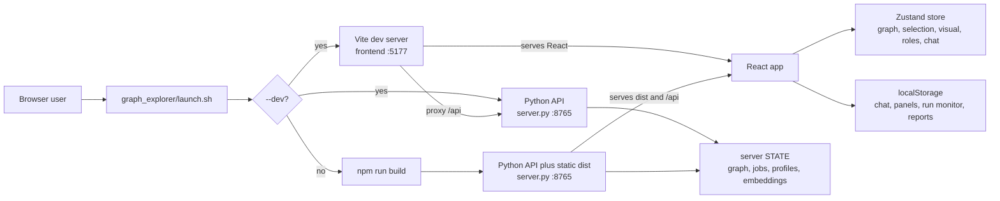
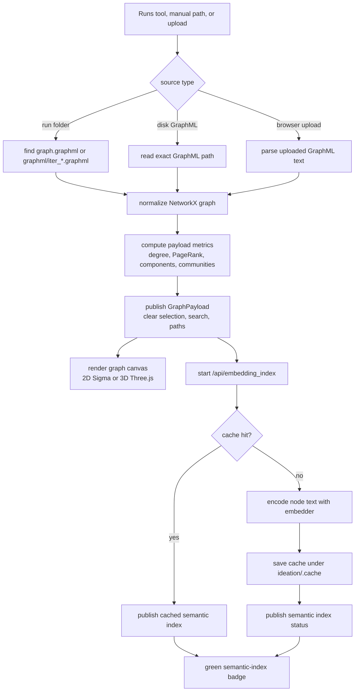
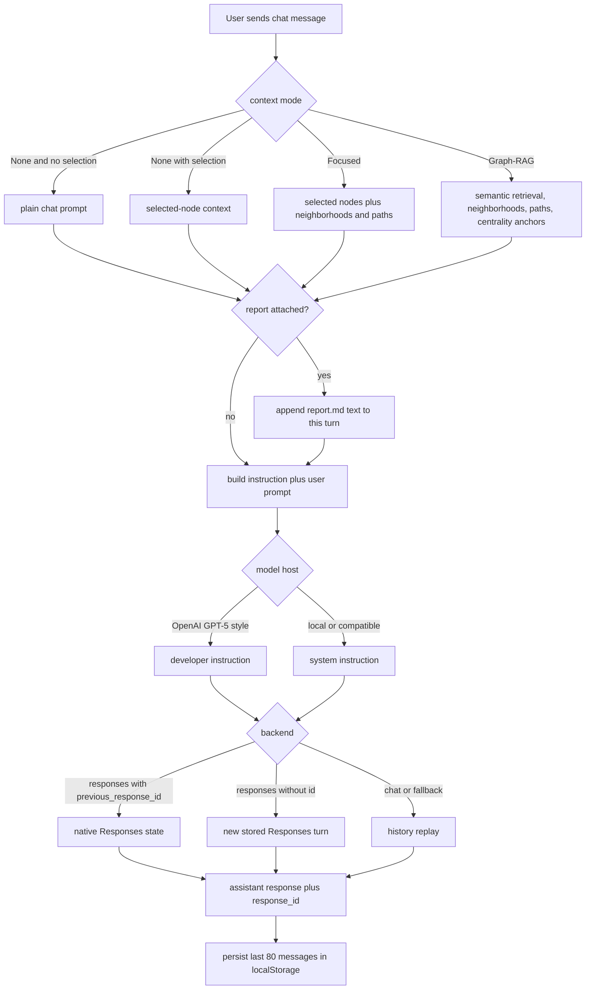
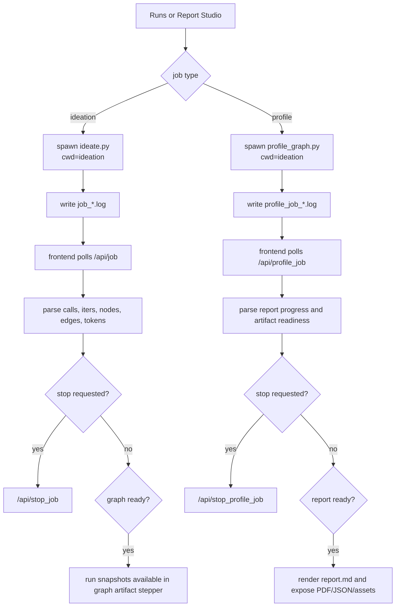

# Graph Explorer

Interactive browser explorer for Graph-PRefLexOR run folders and GraphML artifacts.

This README is intentionally implementation-facing. It is the handoff document for
future agents working on `ideation/graph_explorer/`; read it before changing
`server.py`, the React app, model routing, run monitoring, graph retrieval, or the
profile-report workflow.

## Current Shape

The explorer is a local browser app with a Python API/static server and a
React/Vite frontend.

- Backend: `server.py`, using stdlib `ThreadingHTTPServer` plus NetworkX.
- Frontend: `frontend/src`, using React 19, TypeScript, Vite, Zustand,
  TanStack Query, Sigma.js for 2D graph rendering, Three.js for 3D graph
  rendering, and lucide-react icons.
- Default graph view: 2D map. Users can switch to the 3D explorer.
- Default chat model: `google/gemma-4-E4B-it` on `http://localhost:1234/v1`.
- Default LLM backend mode: OpenAI Responses API (`backend: responses`).
- Default chat context mode: `None`, meaning no graph context unless nodes are
  selected or a report is attached.
- The server can start without graph data. The UI should then guide the user to
  load a run folder, a disk GraphML file, or an uploaded GraphML file.

## Quick Start

Run commands from `ideation/`.

Production-style local launch:

```bash
graph_explorer/launch.sh --run runs/exp_leap --port 8765
```

Open:

```text
http://127.0.0.1:8765
```

Development launch with Vite hot reload:

```bash
graph_explorer/launch.sh --dev --run runs/exp_leap --port 8765 --vite-port 5177
```

Open:

```text
http://127.0.0.1:5177
```

The dev launcher starts the Python API on `--port` and the Vite app on
`--vite-port`. Vite proxies `/api/*` to the Python API. If Vite reports
`ECONNREFUSED 127.0.0.1:<port>`, the Python API did not start or exited before
the frontend made its first request.

Starting empty is valid:

```bash
graph_explorer/launch.sh --port 8765
```

The UI should remain usable and ask the user to load a graph from the Runs tool.

## Directory Map

```text
ideation/graph_explorer/
  README.md                  This handoff document.
  launch.sh                  Production/dev launcher.
  server.py                  Python HTTP API, graph IO, metrics, jobs, model calls.
  logo.gif                   Top-left brand mark used by the React app.
  static/                    Legacy static UI fallback; not the main UI.
  frontend/
    package.json             React/Vite dependencies and scripts.
    vite.config.ts           Vite config; dev proxy uses GRAPH_EXPLORER_API_PORT.
    src/
      main.tsx               Current main React shell; large and due for splitting.
      api.ts                 Typed frontend wrappers for Python API endpoints.
      types.ts               Shared frontend payload contracts.
      store.ts               Zustand graph, selection, visual, role, chat state.
      graph-utils.ts         Metrics, layouts, colors, sizes, edge/path helpers.
      styles.css             Primary application styling.
      components/common.tsx  Drawers, icon buttons, shared UI helpers.
      features/runs.tsx      Run Explorer and Run Monitor.
      features/reporting.tsx Report Studio and report rendering.
```

Path assumptions in `server.py`:

- `ROOT = ideation/graph_explorer`
- `IDEATION_DIR = ideation`
- `PROJECT_DIR = repository root`
- Profile and ideation subprocesses run with `cwd=IDEATION_DIR`.
- Embedding cache files are stored under
  `ideation/.cache/graph_explorer/embeddings`.

## Build And Check Commands

Frontend check:

```bash
cd graph_explorer/frontend
npm run check
```

Frontend production build:

```bash
cd graph_explorer/frontend
npm run build
```

Backend syntax check:

```bash
python -m py_compile graph_explorer/server.py
```

The launcher installs frontend dependencies on first run if
`frontend/node_modules` is missing.

## Runtime Architecture

`server.py` keeps process-local state in the global `STATE` dict guarded by
`LOCK`.

Important state keys:

- `graph`: active normalized NetworkX graph, or `None`.
- `graph_id`: signature-like identifier for the active graph payload.
- `graph_name`: display name.
- `graph_path`: source path for disk-loaded graphs.
- `topic`: run topic if known.
- `jobs`: active or recent `ideate.py` subprocess jobs.
- `profile_jobs`: active or recent `profile_graph.py` subprocess jobs.
- `embedding_job`: current semantic-index build status.
- `embedding_index`: active node embedding index for graph retrieval.
- `embedding_models`: in-process embedding model cache.
- `hf_cache`: in-process local Hugging Face causal model cache.

The frontend holds UI state in Zustand:

- Active graph payload and selected nodes.
- Search results and highlighted paths.
- Visual settings: view mode, layout, color metric, palette, size metric,
  edge opacity.
- Model roles and selected chat role.
- Chat messages.

Browser-local persistence is used for selected UI state:

- Chat history: `graph-preflexor-explorer.chat.v1`, last 80 messages.
- Run monitor state: `graph-preflexor-explorer.run-monitor.v1`.
- Report Studio state: `graph-preflexor-explorer.report-studio.v1`.
- Left/right panel widths.
- Optional tools in the left rail.

Default Graph Assistant output budget is `20000` requested tokens. This is a
request cap, not a hard guarantee: providers and local servers still enforce
their own model/context limits, and the backend retries with lower caps if a
selected server rejects the requested value.

## Software Design Flowcharts

These diagrams describe the current implementation paths. If code changes alter
one of these flows, update this section in the same change.

Launch and request routing:



Graph loading and semantic indexing:



Graph Assistant request assembly:



Long-running jobs:



## Graph Loading Lifecycle

The active graph can come from three places:

1. A run folder, for example `runs/exp_leap`.
2. A server-visible GraphML file path.
3. A browser upload of a GraphML/XML file.

Run folder loading searches for readable GraphML candidates. It expects either a
final `graph.graphml` or generated snapshots such as `graphml/iter_*.graphml`.
If more than one candidate exists, the run-loading helper chooses the current
candidate and the graph artifact window exposes iteration stepping.

When a graph is loaded:

- The backend normalizes the GraphML into a simple NetworkX graph.
- Multi-edge relations are merged into a single edge with relation strings
  joined by ` | ` and a `multiplicity` count.
- The frontend receives a `GraphPayload` with computed metrics and raw attrs.
- Selection, search results, and highlighted paths are cleared.
- The semantic embedding index is started or loaded from cache.

When a new ideation run is started from the UI, the current graph is cleared
first. This avoids showing stale graph data while the run is producing new
artifacts.

## Graph Payload Contract

See `frontend/src/types.ts` for the source of truth. Main fields:

```ts
type GraphPayload = {
  graph_id?: string;
  name: string;
  path: string;
  topic: string;
  stats: GraphStats;
  nodes: GraphNode[];
  edges: GraphEdge[];
};
```

Node metrics currently exposed:

- degree
- pagerank
- core
- closeness
- betweenness
- clustering
- eigenvector
- component
- community
- iter
- depth
- attrs

Edge fields:

- source
- target
- relation
- iter
- depth
- attrs

Do not assume labels are unique. Use node ids for graph operations, and use
labels only as display or fuzzy matching inputs.

## UI Surfaces

The app uses a left activity rail plus resizable left and right panels.

Core tools:

- Workspace: high-level working area and app navigation.
- Graph: graph stats, visual mapping, display controls, layouts, palettes,
  node sizing, edge opacity.
- Search: node search, hub shortcuts, selection focus, and selected-node list.
- Focus tools: neighborhoods, paths, ordered routes, pairwise bridges, and
  stochastic multi-concept bridge exploration.
- Runs: run folder browser, disk GraphML loader, upload GraphML, run monitor.
- Reports: Report Studio, profile job monitor, report list, Markdown/PDF/JSON
  artifacts, and chat attachment selection.
- Models: role-based model settings, presets, probes, config preview/save.
- Graph-RAG Explorer: optional tool added from the plus button in the left rail.

The right panel is always the Graph Assistant chat. Chat output should not move
to the graph canvas or tool panels.

The graph artifact window owns the visualization. The compact iteration stepper
lives at the bottom of this window, not in the Runs panel.

## Selection And Interaction

Selection behavior:

- Click a node to select it.
- Shift-click a node to add it to the current selection.
- In the 2D map, click-and-drag a node to reposition it in the current
  browser view. This is an interactive layout edit only; it does not rewrite
  the source GraphML.
- Search results can select nodes; shift-select appends when wired through the
  selection handler.
- Selected nodes should be visibly highlighted in both 2D and 3D modes.

Path and focus behavior:

- Neighborhood focus expands from selected or typed seed nodes.
- Path search accepts source and target ids or labels and resolves close
  label/attribute matches.
- Multi-concept bridge tools accept selected nodes, typed concepts, or a query.
- Ordered route means a path through anchors in sequence.
- Pairwise bridge means connectors between all anchor pairs.
- Stochastic bridge sampling samples candidate anchor combinations and surfaces
  recurring connectors; it is meant for exploratory SciAgents-style ideation.

## Visualization

The frontend exposes:

- View mode: 2D or 3D.
- Canvas theme: black canvas or white canvas. The theme applies only to the
  graph artifact canvas, not the surrounding light UI shell.
- Layouts: force, component, community, degree, timeline.
- Node color metrics: component, community, degree, PageRank, k-core,
  iteration, depth.
- Palettes: atlas, viridis, plasma, graphite, categorical.
- Node size metrics: degree, PageRank, k-core, constant.
- Edge opacity.
- Edge width.
- 2D edge style: straight lines or directed arrows.

2D rendering uses Sigma.js and graphology. 3D rendering uses Three.js. The 3D
view should be treated as a graph explorer, not just a decorative preview:
selected nodes, highlighted paths, and graph-RAG surfaces should remain visible.
Edge color is relation-based via `edgeColor(edge, opacity)`, which hashes the
edge `relation` into the graph palette and applies the configured opacity.
Highlighted paths override edge color and width. Curved all-edge rendering is
not currently a Sigma built-in; 3D highlighted paths are rendered as curved
tubes, while full curved 2D edges would require a custom Sigma edge program.

## Semantic Embedding Index

The semantic index is built in the background after graph load. It powers
semantic search and Graph-RAG context assembly.

Default embedding model:

```text
google/embeddinggemma-300m
```

Cache behavior:

- Cache key includes graph signature, embedding model, and
  `EMBEDDING_CACHE_VERSION`.
- Cache files live under `ideation/.cache/graph_explorer/embeddings`.
- Previously loaded graphs should reuse cached embeddings when the graph
  signature and model match.
- The UI shows a compact semantic-index checkmark next to the graph artifact
  title. Clicking it expands details and exposes rebuild.

Status payload:

```ts
type EmbeddingStatus = {
  status: "idle" | "running" | "done" | "failed";
  ready: boolean;
  nodes: number;
  dimension: number;
  cached?: boolean;
  cache_key?: string;
  cache_path?: string;
  progress: { percent: number; current: number; total: number; message: string; detail: string };
};
```

If embeddings are unavailable, retrieval falls back to text/attribute search
where possible. Do not claim true embedding similarity unless
`embedding_status.ready` is true.

## Graph Assistant

The right panel is the persistent Graph Assistant.

Assistant instruction in `server.py`:

```text
You are Graph-PRefLexOR Assistant, a graph-aware research copilot for scientific ideation...
```

For OpenAI-hosted GPT-5 style models, the instruction role is `developer`. For
local OpenAI-compatible models and most other providers, the instruction role is
`system`.

The chat context mode controls the graph packet:

- `None`: default. If no nodes are selected, this is regular chat. If nodes are
  selected, only selected-node context is sent.
- `Focused`: sends selected nodes plus compact neighborhoods, important edges,
  and selected path context.
- `Graph-RAG`: sends selected nodes plus semantic/text retrieval hits,
  neighborhoods, path connectors, and centrality anchors.

The user can attach generated profile artifacts to one chat turn. The attachment
selects one profile output folder and can include `report.md`, `profile.json`,
or both. For now, these artifacts are appended as text context to that turn's
user prompt. They are not durable file attachments and they are not
automatically sent on every future turn unless the user keeps the profile
context selected.

The chat info icon calls `/api/chat_context_preview` and shows:

- backend
- state mode
- instruction role
- assistant instruction
- exact user prompt
- fallback message history
- public graph/report context summary
- request metadata

When profile context is selected, the preview shows which artifacts will be
sent and the server-side request body includes:

```json
{
  "report_context": {
    "out": "runs/exp_leap/profile_gpt55_light",
    "max_chars": 14000,
    "include_report": true,
    "include_profile": true
  }
}
```

## Chat State Semantics

Default backend mode is Responses:

```yaml
backend: responses
```

Responses state:

- Frontend stores each assistant `response_id`.
- For the next turn with the same model, backend, and base URL, the frontend
  sends `previous_response_id`.
- Backend passes `previous_response_id` to the Responses API with `store: true`.
- If the server rejects a stale `previous_response_id`, the backend falls back
  to replaying recent history.

Chat completions state:

- If a role is configured with `backend: chat`, the frontend/backend replay
  recent user/assistant messages in `messages`.
- This is still multi-turn, but it is history replay rather than native
  Responses state.

Local HF state:

- Local Hugging Face mode also uses replayed history.
- It is intended as a fallback for machines with local weights and
  `transformers`/`torch` installed.

Public response metadata includes:

- `response_id`
- `stateful`
- `state_mode`: `responses_previous_response_id`, `history_replay`, or
  `ready_for_multiturn`
- `backend`

## Model Roles And Config

The frontend model settings edit role blocks that map to `ideation/config.yaml`.

Recognized roles:

- `chat`: main Graph Assistant.
- `questioner`: default fallback for chat and graph QA when no explicit chat
  role exists.
- `graph_qa`: graph question-answering role.
- `generator`: Graph-PRefLexOR generation model.
- `judge`: evaluation/judge model.
- `baseline`: baseline model.
- `embedder`: embedding model name, stored as top-level `embed_model`.

Role fields:

```yaml
provider: openai
model: google/gemma-4-E4B-it
base_url: http://localhost:1234/v1
backend: responses
api_key_env: OPENAI_API_KEY
temperature: 0.3
max_tokens: 20000
reasoning_effort: medium
```

Provider notes:

- `provider: openai` covers OpenAI and OpenAI-compatible local servers.
- Empty `base_url` means the OpenAI hosted API.
- Local servers usually use `http://localhost:1234/v1` or
  `http://localhost:8000/v1`.
- `max_tokens` is the requested assistant answer budget. Use Model Settings to
  raise or lower it per role. The backend maps it to `max_output_tokens` for
  Responses, `max_completion_tokens` for chat completions, and `max_new_tokens`
  for local Hugging Face generation.
- Gemma chat presets must use the instruct/chat model id:
  `google/gemma-4-E4B-it`, not the base `google/gemma-4-E4B`.

The model probe endpoint checks:

1. Basic model config.
2. `/models` for HTTP providers.
3. A tiny generation call.

If a local model is missing or unavailable, the UI should show serving help.

Example mistral.rs direct serving command:

```bash
mistralrs serve -m google/gemma-4-E4B-it --host 127.0.0.1 --port 1234
```

For the explorer, TOML-based mistral.rs serving is often better because the
chat, questioner, graph QA, generator, and judge roles can share one
OpenAI-compatible base URL while selecting different `model` ids.

Example multi-model mistral.rs TOML:

```toml
# Save as graph_explorer.models.toml.
# Every model_id must match the model id selected in the Explorer UI.
command = "serve"
default_model_id = "google/gemma-4-E4B-it"

[server]
host = "127.0.0.1"
port = 1234

[[models]]
kind = "auto"
model_id = "google/gemma-4-E4B-it"

[models.quantization]
in_situ_quant = "8"

[[models]]
kind = "auto"
model_id = "Qwen/Qwen3-4B"

[models.quantization]
in_situ_quant = "8"

[[models]]
kind = "auto"
model_id = "lamm-mit/Graph-Preflexor-3b_08012026"

[models.quantization]
in_situ_quant = "8"
```

Run the TOML server:

```bash
mistralrs from-config -f graph_explorer.models.toml
```

Then point local OpenAI-compatible roles at:

```text
http://localhost:1234/v1
```

Recommended local role mapping for that TOML:

```yaml
chat:
  provider: openai
  backend: responses
  model: google/gemma-4-E4B-it
  base_url: http://localhost:1234/v1
questioner:
  provider: openai
  backend: responses
  model: google/gemma-4-E4B-it
  base_url: http://localhost:1234/v1
graph_qa:
  provider: openai
  backend: responses
  model: google/gemma-4-E4B-it
  base_url: http://localhost:1234/v1
generator:
  provider: openai
  backend: responses
  model: lamm-mit/Graph-Preflexor-3b_08012026
  base_url: http://localhost:1234/v1
  temperature: 0.1
  max_tokens: 8000
baseline:
  provider: openai
  backend: responses
  model: Qwen/Qwen3-4B
  base_url: http://localhost:1234/v1
```

Example vLLM direct serving command:

```bash
vllm serve google/gemma-4-E4B-it \
  --host 127.0.0.1 \
  --port 8000 \
  --served-model-name google/gemma-4-E4B-it
```

If TOML-based serving is shown in the UI, also show the TOML content and provide
a way to download/copy it. Do not show a TOML command without the matching TOML
file contents.

## Run Explorer And Run Monitor

The Runs tool does three separate things:

1. Loads existing run folders.
2. Loads individual server-visible GraphML files or browser-uploaded GraphML.
3. Starts new `ideate.py` runs and monitors progress from logs.

Available strategy presets:

- frontier
- node
- answer
- edge
- novelty
- leap
- converse
- mixed

Run monitor behavior:

- Starts `ideate.py` in a subprocess with `cwd=ideation`.
- Persists job metadata in browser localStorage.
- Polls `/api/job?id=...`.
- Tracks calls, iterations, nodes, edges, new nodes, tokens, diversity, and log
  tail when available.
- Offers a stop button via `/api/stop_job`.
- Does not switch the active tab away from Runs after starting.

Graph snapshots:

- `/api/run_graphs` returns graph snapshots for a run.
- The graph artifact window shows a one-line bottom iteration stepper.
- Previous/next/dropdown load snapshots into the active graph.
- Snapshot loading should preserve the user's selected tool tab.

## Report Studio

Report Studio wraps `profile_graph.py`.

It can profile:

- A run folder (`--run`), using the latest graph snapshot.
- A server-visible GraphML file (`--graph`).

It can list and render profile artifacts:

- `report.md`
- `profile.json`
- `report.pdf` when generated
- figure assets

Report Studio returns `report.md` and `profile.json` through
`/api/profile_report`. In chat, users can attach `report.md`, `profile.json`,
or both to one Graph Assistant turn as extra text context.

Deep OpenAI-style report preset:

```bash
python profile_graph.py \
  --run runs/exp_leap \
  --out runs/exp_leap/profile_gpt55 \
  --embed-model auto \
  --llm \
  --backend responses \
  --model gpt-5.5 \
  --reasoning-effort high \
  --llm-modules 12 \
  --llm-deep-passes 4 \
  --max-summary-tokens 1600 \
  --deep-pass-tokens 5000 \
  --deep-dive-tokens 12000 \
  --report-review-tokens 10000
```

Light preset:

```bash
python profile_graph.py \
  --run runs/exp_leap \
  --out runs/exp_leap/profile_gpt55_light \
  --embed-model auto \
  --profile-preset light \
  --backend responses \
  --model gpt-5.5
```

The light preset implies:

```text
--llm
--llm-modules 6
--llm-deep-passes 1
--max-summary-tokens 900
--deep-pass-tokens 2500
--deep-dive-tokens 6000
--reasoning-effort medium
--no-llm-report-review
```

The backend command builder also supports:

- `--top-nodes`
- `--max-modules`
- `--base-url`
- `--temperature`
- `--report-review-max-chunks`
- `--report-review-chunk-chars`
- `--report-review-memo-chars`
- `--device`
- `--dtype`
- `--no-pdf`

## API Reference

GET endpoints:

| Endpoint | Purpose |
| --- | --- |
| `/api/graph` | Current active graph payload. Requires a loaded graph. |
| `/api/runs` | List discovered run folders and summary metadata. |
| `/api/job?id=...` | Ideation run job status and progress. |
| `/api/profile_job?id=...` | Profile job status and progress. |
| `/api/embedding_status` | Current semantic-index status. |
| `/api/report_asset?out=...&file=...` | Download/render a report asset. |
| `/api/config` | Current model role config from `ideation/config.yaml`. |

POST endpoints:

| Endpoint | Purpose |
| --- | --- |
| `/api/load_graphml` | Load uploaded GraphML text. |
| `/api/load_run` | Load a run folder or a GraphML path. |
| `/api/run_graphs` | List graph snapshots for a run. |
| `/api/graphml_files` | List available GraphML files under known run roots. |
| `/api/search` | Search graph nodes by text, metrics, and semantic score when available. |
| `/api/embedding_index` | Start or rebuild the semantic index. |
| `/api/neighborhood` | Return a focused neighborhood subgraph. |
| `/api/path` | Return shortest/simple paths between source and target. |
| `/api/multipath` | Return pairwise, ordered, or stochastic bridge/path subgraphs. |
| `/api/bridge_suggestions` | Generate bridge exploration ideas from selected nodes. |
| `/api/ask` | Ask the Graph Assistant. |
| `/api/chat_context_preview` | Show exact context and messages for a chat turn. |
| `/api/graph_rag_context` | Build graph retrieval context without an LLM call. |
| `/api/ideate` | Start an `ideate.py` run. |
| `/api/clear_graph` | Clear active graph state. |
| `/api/stop_job` | Stop an ideation job. |
| `/api/profile_graph` | Start a `profile_graph.py` report job. |
| `/api/stop_profile_job` | Stop a profile job. |
| `/api/profile_reports` | List reports for a run. |
| `/api/profile_report` | Return report Markdown, profile JSON text, and artifact metadata. |
| `/api/model_status` | Lightweight `/models` status check. |
| `/api/model_probe` | Config, `/models`, and tiny-generation probe. |
| `/api/config_preview` | Render config YAML from proposed roles. |
| `/api/save_config` | Persist model role config to `ideation/config.yaml`. |
| `/api/compare_run` | Compare run-level output metadata. |

## Agent Coverage Checklist

Before a future agent edits the explorer, it should be able to answer these
questions from this README and the referenced source files:

- How is the app launched in production mode and dev mode?
- Where does Vite proxy API requests in dev mode?
- Which Python process owns active graph state?
- Which browser state is persisted in localStorage?
- What happens when a graph is loaded, cleared, or replaced?
- How are generated run snapshots discovered and stepped through?
- How is the background embedding index started, cached, and surfaced?
- Which UI surface owns graph loading, visual controls, search, focus tools,
  chat, model settings, and reports?
- How does shift-click multi-selection work conceptually?
- Which graph metrics can drive color, size, layout, search, and context?
- What is the difference between `None`, `Focused`, and `Graph-RAG` chat
  context?
- How is the exact LLM context previewed before a chat request?
- How does Responses multi-turn state use `previous_response_id`?
- What is the fallback for backends that require history replay?
- How are report attachments transmitted to the assistant?
- Which model roles map to `config.yaml`?
- How should local multi-model mistral.rs serving be configured?
- How are `ideate.py` and `profile_graph.py` jobs launched, polled, stopped,
  and rendered?
- Which API endpoints exist and what payload types should the frontend use?
- What technical debt should be addressed before adding major new features?

## Development Guidelines For Agents

Preserve these behavior contracts unless the user asks for a breaking change:

- The app must launch with no graph loaded.
- Loading a new graph must clear stale selection, search results, paths, and
  stale embedding state.
- Starting a new ideation run must clear the old active graph first.
- The chat panel stays in the right panel.
- Chat default context is `None`.
- Responses backend is the default for all chat/instruct models.
- Chat must remain multi-turn through Responses `previous_response_id` or
  history replay fallback.
- Report attachments are user-selected context for a turn, not hidden global
  context.
- Iteration stepping belongs in the graph artifact window.
- Model settings belong in Models, not inline in the chat header.
- Runs is the only place for graph/run loading controls.
- Search owns selection focus; Graph owns display/stats/visual mapping.

When adding backend endpoints:

- Add a typed wrapper in `frontend/src/api.ts`.
- Add or update frontend payload types in `frontend/src/types.ts`.
- Keep errors user-readable. Avoid raw `int("")`/`float("")` failures.
- If a long task is launched, expose progress and a stop endpoint.

When adding UI features:

- Prefer compact controls and tooltips over explanatory text blocks.
- Keep font sizing dense and professional.
- Avoid moving user context unexpectedly between tabs.
- Keep Graph Assistant state visible and predictable.
- Use existing shared controls in `components/common.tsx` where possible.

## Useful Product Improvements

These are good next additions if the user asks to keep expanding the explorer:

- Profile context manager: let users pin multiple generated profiles, compare
  their `profile.json` summaries, and choose one or more as chat context.
- Context budget meter: show an estimated token count for selected graph nodes,
  Graph-RAG retrieval, `report.md`, and `profile.json` before sending.
- Graph-RAG source citations: when the assistant answers from retrieved graph
  context, show expandable source nodes, paths, and profile sections below the
  answer.
- Saved workspace sessions: persist loaded run, selected graph snapshot, visual
  settings, selected nodes, attached profile context, and chat thread under a
  named session.
- Profile diff view: compare two `profile.json` files for graph growth,
  community shifts, hub changes, bridge changes, and LLM summary differences.
- Report-to-graph linking: clicking a node/community/path reference in
  `report.md` or `profile.json` should select or highlight it in the graph
  artifact window.
- Retrieval diagnostics: show why Graph-RAG selected each node, including
  semantic score, text score, neighborhood expansion, path connector role, and
  centrality anchor reason.
- Export bundle: download a portable ZIP containing the active graph snapshot,
  visual config, selected profile artifacts, and chat transcript.

## Known Technical Debt

Captured 2026-06-14 while hardening the explorer:

- `server.py` is too large for sustained feature work. Split it into graph IO,
  metrics/search, embeddings/cache, model calls, run jobs, profile jobs, and
  HTTP routing.
- `frontend/src/main.tsx` is too large. Split graph canvases, chat, focus tools,
  model settings, and workspace layout into separate feature modules.
- Move expensive embedding cache work fully outside the global server lock. The
  server should snapshot graph state under lock, release it for hashing/cache
  IO, then reacquire only to publish status.
- Replace the manual API `if/elif` router with small route handlers plus typed
  request coercion to avoid fragile parsing and improve error messages.
- Scope persisted chat state by graph/run/session instead of using one global
  browser storage key.
- Replace the hand-rolled Markdown report/chat renderer with a maintained
  Markdown/GFM/LaTeX renderer before reports become a primary surface.
- Add focused tests for GraphML candidate selection, embedding cache
  round-trips, path resolution, model probe fallback, run monitor persistence,
  and React smoke tests.
- Add Playwright coverage for graph loading, shift-click selection, graph
  snapshot stepping, report attachment preview, and chat context preview.

## Common Failure Modes

No graph appears after loading:

- Check `/api/graph` in the browser network panel.
- Confirm the run contains readable GraphML.
- Try loading a specific GraphML path from Runs.
- Check server output for GraphML parse errors.

Vite proxy errors:

- Confirm the Python API is still running on the same `--port`.
- Confirm `GRAPH_EXPLORER_API_PORT` matches the launcher `--port`.
- Start with `graph_explorer/launch.sh --dev ...` rather than starting Vite
  alone.

Local model probe fails:

- Confirm the model id exactly matches `/v1/models`.
- For Gemma chat, use `google/gemma-4-E4B-it`.
- Confirm `base_url` includes `/v1`.
- If the model requires an API key, set the configured `api_key_env`.

Responses state appears lost:

- Confirm the assistant response returned a `response_id`.
- Confirm the next request uses the same model, backend, and base URL.
- Use the chat info modal to inspect whether the request uses
  `responses_previous_response_id` or `history_replay`.

Report does not render or download:

- Check Report Studio job log tail.
- Confirm the selected `out` directory contains `report.md`.
- PDF download only appears when `profile_graph.py` generated a PDF and the
  file exists.
